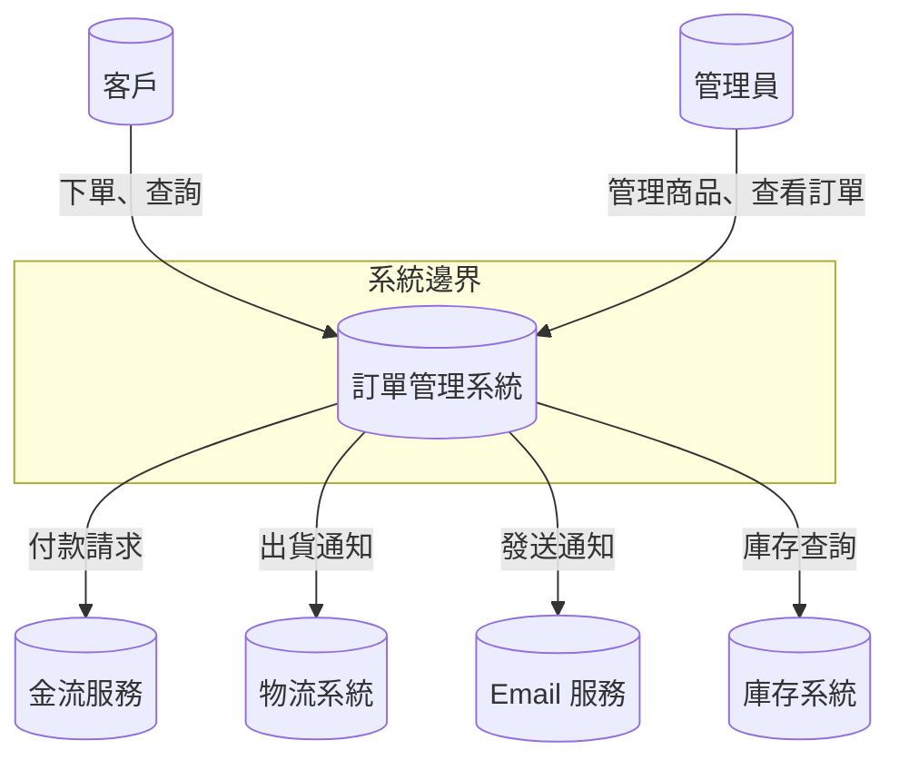

# 第 8 章：AI 與系統分析

系統分析是軟體開發生命週期中最需要「理解人」的階段。傳統上，系統分析師需與利害關係人反覆溝通，從模糊的對話與零散的文件中提煉出精確的需求規格。大型語言模型的出現，讓這個過程產生了根本性的變化——AI 不再只是被動的記錄工具，而是能夠主動分析、推論、組織資訊的分析夥伴。

本章將探討 AI 如何在需求擷取、規格撰寫、可行性分析、領域建模、系統邊界界定等系統分析的關鍵活動中發揮作用，並透過完整的案例展示從會議記錄到正式需求規格的轉換過程。

## 8.1 AI 輔助需求擷取

需求擷取是系統分析的第一步，也是最困難的一步。利害關係人往往不清楚自己想要什麼，或者無法精確表達需求。AI 可以從多個來源協助分析師梳理需求。

### 8.1.1 從自然語言提取需求

利害關係人通常以自然語言描述他們的需求。AI 可以從這些描述中自動提取結構化的需求項目。

以下是一個使用 Python 搭配大型語言模型從對話中提取需求的範例：

```python
import json
from openai import OpenAI

client = OpenAI()

def extract_requirements_from_dialogue(dialogue_text: str) -> dict:
    prompt = f"""你是一位經驗豐富的系統分析師。請從以下的對話中提取出所有需求，
並將它們分類為功能需求、非功能需求與業務規則。

對話內容：
{dialogue_text}

請以 JSON 格式回覆，格式如下：
{{
    "functional_requirements": [
        {{"id": "FR-001", "title": "需求名稱", "description": "需求描述", "priority": "high|medium|low"}}
    ],
    "non_functional_requirements": [
        {{"id": "NFR-001", "title": "需求名稱", "description": "需求描述", "category": "performance|security|usability|..."}}
    ],
    "business_rules": [
        {{"id": "BR-001", "description": "規則描述"}}
    ]
}}
"""
    response = client.chat.completions.create(
        model="gpt-4",
        messages=[{"role": "user", "content": prompt}],
        response_format={"type": "json_object"}
    )
    return json.loads(response.choices[0].message.content)


dialogue = """
產品經理：我們需要一個新的訂單管理系統。目前客戶下單後都要人工確認，太慢了。
工程師：所以是希望自動化處理流程？
產品經理：對，至少標準訂單要能自動通過，只有異常訂單才需要人工介入。
工程師：那付款確認這塊呢？
產品經理：需要串接金流服務，支援信用卡和 ATM 轉帳。
工程師：訂單量大約多少？
產品經理：目前每天約 500 筆，預計一年內成長到 2000 筆。
"""

result = extract_requirements_from_dialogue(dialogue)
print(json.dumps(result, indent=2, ensure_ascii=False))
```

輸出結果可能如下：

```json
{
  "functional_requirements": [
    {
      "id": "FR-001",
      "title": "自動訂單審核",
      "description": "標準訂單無需人工確認即可自動通過審核",
      "priority": "high"
    },
    {
      "id": "FR-002",
      "title": "異常訂單標記",
      "description": "異常訂單自動標記並通知審核人員",
      "priority": "high"
    },
    {
      "id": "FR-003",
      "title": "金流串接",
      "description": "支援信用卡與 ATM 轉帳付款",
      "priority": "high"
    }
  ],
  "non_functional_requirements": [
    {
      "id": "NFR-001",
      "title": "訂單處理效能",
      "description": "系統需能處理每日 2000 筆以上的訂單",
      "category": "performance"
    }
  ],
  "business_rules": [
    {
      "id": "BR-001",
      "description": "訂單金額低於 NT$10,000 且非高風險商品視為標準訂單"
    }
  ]
}
```

### 8.1.2 使用者訪談分析

使用者訪談是需求擷取的重要來源，但訪談記錄通常篇幅長、結構鬆散。AI 可以協助分析訪談內容，找出關鍵洞察。

```python
def analyze_interview(transcript: str) -> dict:
    prompt = f"""分析以下使用者訪談記錄，輸出：

1. 痛點 (Pain Points)：使用者目前遇到的問題
2. 期望 (Expectations)：使用者希望系統做到的事情  
3. 工作流程 (Workflow)：使用者目前的工作流程描述
4. 隱含需求 (Implicit Needs)：使用者沒有明說但可推論的需求

訪談記錄：
{transcript}
"""
    response = client.chat.completions.create(
        model="gpt-4",
        messages=[{"role": "user", "content": prompt}]
    )
    return response.choices[0].message.content
```

### 8.1.3 既有系統分析

當專案涉及系統遷移或功能增強時，既有系統的文件、程式碼、資料庫 schema 都是重要的需求來源。AI 可以閱讀這些技術產物並提煉出隱含的需求。

```python
def analyze_legacy_system(codebase_summary: str, db_schema: str) -> dict:
    prompt = f"""你是系統分析師，正在分析一個既有系統。
請根據以下程式碼摘要與資料庫 Schema，推論出該系統目前提供的功能，
以及潛在的問題或待改進之處。

程式碼摘要：
{codebase_summary}

資料庫 Schema：
{db_schema}

請列出功能列表與改善建議。
"""
    response = client.chat.completions.create(
        model="gpt-4",
        messages=[{"role": "user", "content": prompt}]
    )
    return response.choices[0].message.content
```

## 8.2 需求規格撰寫

擷取需求之後，下一步是將其整理為結構化的需求規格文件。AI 可以在這個階段大幅減輕文件撰寫的負擔。

### 8.2.1 功能需求與非功能需求

AI 可以從需求描述中自動區分功能需求與非功能需求，並為每個需求生成清晰的描述。

```python
def generate_requirement_spec(requirements: list[dict]) -> str:
    prompt = f"""請根據以下需求項目，撰寫一份正式的需求規格說明。
每個需求需包含：唯一識別碼、名稱、描述、優先級、來源。

需求項目：
{json.dumps(requirements, indent=2, ensure_ascii=False)}

請以 Markdown 表格格式輸出，按功能需求與非功能需求分開。
"""
    response = client.chat.completions.create(
        model="gpt-4",
        messages=[{"role": "user", "content": prompt}]
    )
    return response.choices[0].message.content
```

需求規格產出的範例：

```markdown
## 功能需求

| 編號 | 名稱 | 描述 | 優先級 | 來源 |
|------|------|------|--------|------|
| FR-001 | 會員註冊 | 使用者可透過 Email 或第三方登入註冊帳號 | 高 | PM訪談 |
| FR-002 | 商品搜尋 | 使用者可依關鍵字、分類、價格區間搜尋商品 | 高 | 使用者訪談 |
| FR-003 | 購物車管理 | 使用者可將商品加入購物車並修改數量 | 高 | PM訪談 |
| NFR-001 | 回應時間 | 頁面載入時間不得超過 2 秒 | 高 | 效能需求 |
| NFR-002 | 可用性 | 系統可用性需達 99.9% | 中 | SLA要求 |
| NFR-003 | 資料加密 | 使用 AES-256 加密靜態資料 | 高 | 資安政策 |

### 8.2.2 使用者故事與驗收標準

敏捷開發中，使用者故事 (User Story) 是描述需求的標準格式。AI 可以從需求規格自動生成使用者故事與對應的驗收標準。

```python
def generate_user_stories(requirement: dict) -> str:
    prompt = f"""請根據以下需求，產生一組使用者故事 (User Story) 及其驗收標準。

需求名稱：{requirement['title']}
需求描述：{requirement['description']}
需求類型：{requirement['type']}

輸出格式：
## User Story
作為一個 [角色]
我想要 [功能]
以便 [商業價值]

## 驗收標準 (Acceptance Criteria)
- Given [情境] When [動作] Then [結果]
- Given [情境] When [動作] Then [結果]
"""
    response = client.chat.completions.create(
        model="gpt-4",
        messages=[{"role": "user", "content": prompt}]
    )
    return response.choices[0].message.content
```

範例輸出：

```markdown
## User Story
作為一個 註冊會員
我想要 使用第三方帳號快速登入
以便 省去填寫註冊表的時間

## 驗收標準
- 給定 使用者尚未登入 當 使用者點擊「使用 Google 登入」 則 系統引導至 Google OAuth 頁面
- 給定 使用者授權成功 當 Google 回傳授權碼 則 系統建立或配對會員帳號並登入
- 給定 使用者首次使用 Google 登入 當 系統發現無配對帳號 則 自動建立新會員帳號
- 給定 Google 授權失敗 當 使用者取消授權 則 系統顯示錯誤訊息並留在登入頁面
```

### 8.2.3 需求追溯矩陣

需求追溯矩陣 (Requirements Traceability Matrix, RTM) 確保每個需求都與設計、實作、測試相對應。AI 可以輔助建立並維護追溯關係。

```python
def generate_rtm(requirements: list[dict]) -> str:
    prompt = f"""請根據以下需求列表，產生需求追溯矩陣 (RTM)，
標示每個需求對應的設計模組、實作元件與測試案例。

需求列表：
{json.dumps(requirements, indent=2, ensure_ascii=False)}

以 Markdown 表格輸出，欄位包含：需求編號、設計模組、實作檔案、測試案例、狀態。
"""
    response = client.chat.completions.create(
        model="gpt-4",
        messages=[{"role": "user", "content": prompt}]
    )
    return response.choices[0].message.content
```

需求追溯矩陣範例：

| 需求編號 | 設計模組 | 實作檔案 | 測試案例 | 狀態 |
|---------|---------|---------|---------|------|
| FR-001 | 會員模組 | `src/auth/register.py` | `test_register.py` | 已完成 |
| FR-002 | 搜尋模組 | `src/search/` | `test_search.py` | 開發中 |
| NFR-001 | 系統架構 | `nginx.conf`, `cache.py` | `test_performance.py` | 待審查 |

## 8.3 可行性分析

在投入大量資源開發之前，必須評估專案的可行性。AI 可以從技術、成本、風險三個維度提供分析建議。

### 8.3.1 技術可行性評估

```python
def technical_feasibility(requirements: list[dict], team_skills: str, tech_stack: str) -> str:
    prompt = f"""你是一位技術顧問，請評估以下專案的技術可行性。

需求摘要：
{json.dumps(requirements, indent=2, ensure_ascii=False)}

團隊技術能力：{team_skills}
預計技術棧：{tech_stack}

請分析：
1. 技術難點與挑戰
2. 建議的技術方案
3. 技術風險等級 (高/中/低)
4. 需要的前置研究或原型開發
"""
    response = client.chat.completions.create(
        model="gpt-4",
        messages=[{"role": "user", "content": prompt}]
    )
    return response.choices[0].message.content
```

### 8.3.2 成本估算

成本估算可以基於功能點分析 (Function Point Analysis) 搭配 AI 的歷史數據比對。

```python
def estimate_cost(requirements: list[dict]) -> str:
    prompt = f"""請根據以下需求進行功能點分析與成本估算。

需求列表：
{json.dumps(requirements, indent=2, ensure_ascii=False)}

請提供：
1. 功能點估算 (FP)
2. 根據 COCOMO II 模型的開發人月估算
3. 預估開發成本範圍
4. 建議的開發時程
5. 主要成本驅動因素分析
"""
    response = client.chat.completions.create(
        model="gpt-4",
        messages=[{"role": "user", "content": prompt}]
    )
    return response.choices[0].message.content
```

### 8.3.3 風險識別

AI 可以透過分析需求內容與專案背景，自動識別潛在風險並建議緩解策略。

```python
def identify_risks(requirements: list[dict], project_context: str) -> list[dict]:
    prompt = f"""請分析以下專案資訊，識別出可能的專案風險。

需求清單：
{json.dumps(requirements, indent=2, ensure_ascii=False)}

專案背景：
{project_context}

請以 JSON 格式回覆，每個風險包含：
- risk_id: 風險編號
- category: 類別 (技術/時程/資源/外部/法規)
- description: 風險描述
- probability: 發生機率 (高/中/低)
- impact: 影響程度 (高/中/低)
- mitigation: 緩解策略
"""
    response = client.chat.completions.create(
        model="gpt-4",
        messages=[{"role": "user", "content": prompt}],
        response_format={"type": "json_object"}
    )
    return json.loads(response.choices[0].message.content)
```

## 8.4 領域建模

領域建模是將真實世界的業務概念轉化為軟體模型的過程。AI 可以在實體識別、關係提取、通用語言建立等方面提供強大支援。

### 8.4.1 實體關係提取

從需求描述中自動提取領域實體 (Entity) 與其關係 (Relationship) 是 AI 的強項。

```python
def extract_domain_model(requirement_text: str) -> dict:
    prompt = f"""你是一位領域建模專家。請從以下需求描述中提取出領域模型。

需求描述：
{requirement_text}

請以 JSON 格式輸出，包含：
1. entities: 實體列表（含名稱、屬性、屬性型別）
2. relationships: 關係列表（含來源實體、目標實體、關係類型、多重性）
3. value_objects: 值物件列表
4. aggregates: 聚合根與其邊界

輸出範例：
{{
    "entities": [
        {{"name": "Order", "attributes": [{{"name": "order_id", "type": "UUID"}}, {{"name": "total_amount", "type": "Money"}}]}}
    ],
    "relationships": [
        {{"source": "Order", "target": "Customer", "type": "belongs_to", "multiplicity": "many_to_one"}}
    ],
    "value_objects": [...],
    "aggregates": [...]
}}
"""
    response = client.chat.completions.create(
        model="gpt-4",
        messages=[{"role": "user", "content": prompt}],
        response_format={"type": "json_object"}
    )
    return json.loads(response.choices[0].message.content)


requirement_text = """
客戶可以在電商平台上瀏覽商品並下單。每個訂單包含多個訂單項目，
每個項目對應一個商品與數量。訂單需要經過付款確認後才會出貨。
客戶可以查詢自己的歷史訂單。管理員可以管理商品資訊與查看所有訂單。
"""

domain_model = extract_domain_model(requirement_text)
print(json.dumps(domain_model, indent=2, ensure_ascii=False))
```

AI 提取出的領域模型：

```json
{
  "entities": [
    {
      "name": "Customer",
      "attributes": [
        {"name": "customer_id", "type": "UUID"},
        {"name": "name", "type": "String"},
        {"name": "email", "type": "Email"},
        {"name": "shipping_address", "type": "Address"}
      ]
    },
    {
      "name": "Order",
      "attributes": [
        {"name": "order_id", "type": "UUID"},
        {"name": "order_date", "type": "DateTime"},
        {"name": "status", "type": "OrderStatus"},
        {"name": "total_amount", "type": "Money"}
      ]
    },
    {
      "name": "OrderItem",
      "attributes": [
        {"name": "quantity", "type": "Integer"},
        {"name": "unit_price", "type": "Money"}
      ]
    },
    {
      "name": "Product",
      "attributes": [
        {"name": "product_id", "type": "UUID"},
        {"name": "name", "type": "String"},
        {"name": "price", "type": "Money"},
        {"name": "stock_quantity", "type": "Integer"}
      ]
    },
    {
      "name": "Admin",
      "attributes": [
        {"name": "admin_id", "type": "UUID"},
        {"name": "name", "type": "String"}
      ]
    }
  ],
  "relationships": [
    {"source": "Order", "target": "Customer", "type": "belongs_to", "multiplicity": "many_to_one"},
    {"source": "OrderItem", "target": "Order", "type": "belongs_to", "multiplicity": "many_to_one"},
    {"source": "OrderItem", "target": "Product", "type": "references", "multiplicity": "many_to_one"}
  ],
  "value_objects": [
    {"name": "Money", "attributes": [{"name": "amount", "type": "Decimal"}, {"name": "currency", "type": "String"}]},
    {"name": "Address", "attributes": [{"name": "street", "type": "String"}, {"name": "city", "type": "String"}, {"name": "zipcode", "type": "String"}]},
    {"name": "OrderStatus", "type": "Enum", "values": ["pending", "paid", "shipped", "delivered", "cancelled"]},
    {"name": "Email", "type": "ValueObject"}
  ],
  "aggregates": [
    {
      "name": "Order",
      "root": "Order",
      "boundary": ["OrderItem"],
      "description": "訂單聚合，包含訂單項目，透過 OrderRepository 存取"
    },
    {
      "name": "Product",
      "root": "Product",
      "boundary": [],
      "description": "商品聚合，獨立管理庫存與價格"
    }
  ]
}
```

### 8.4.2 領域驅動設計 (DDD) 輔助

AI 可以根據需求描述協助進行領域驅動設計中的戰略設計與戰術設計。

```python
def ddd_strategic_design(domain_model: dict) -> str:
    prompt = f"""你是一位 DDD 專家。請根據以下領域模型進行戰略設計分析。

領域模型：
{json.dumps(domain_model, indent=2, ensure_ascii=False)}

請分析並輸出：
1. 限界上下文 (Bounded Context) 劃分建議
2. 每個上下文的核心/支援/通用領域分類
3. 上下文映射 (Context Map) 關係圖
4. 聚合 (Aggregate) 設計與邊界建議
5. 領域事件 (Domain Event) 識別
"""
    response = client.chat.completions.create(
        model="gpt-4",
        messages=[{"role": "user", "content": prompt}]
    )
    return response.choices[0].message.content
```

### 8.4.3 通用語言建立

通用語言 (Ubiquitous Language) 是 DDD 的核心概念，確保團隊所有人使用統一的詞彙溝通。AI 可以從需求文件中提取關鍵詞彙並建立詞彙表。

```python
def create_ubiquitous_language(domain_model: dict, requirements: str) -> str:
    prompt = f"""請根據以下領域模型與需求描述，建立通用語言詞彙表 (Ubiquitous Language Glossary)。

領域模型：
{json.dumps(domain_model, indent=2, ensure_ascii=False)}

需求描述：
{requirements}

詞彙表應包含每個詞彙的：
- 名稱 (中/英文)
- 定義
- 使用情境
- 相關詞彙
- 注意事項 (如同一詞彙在不同上下文的差異)
"""
    response = client.chat.completions.create(
        model="gpt-4",
        messages=[{"role": "user", "content": prompt}]
    )
    return response.choices[0].message.content
```

通用語言詞彙表示例：

| 詞彙 | 英文 | 定義 | 上下文 | 注意事項 |
|------|------|------|--------|---------|
| 訂單 | Order | 客戶提交的購買請求，包含多個訂單項目 | 訂單管理 | 與「購物車」不同，訂單已完成結帳 |
| 訂單項目 | OrderItem | 訂單中的單一商品購買明細 | 訂單管理 | 包含數量與單價 |
| 出貨 | Shipment | 訂單商品實際交付的物流記錄 | 物流管理 | 一個訂單可多次出貨 |

## 8.5 系統邊界與脈絡分析

系統邊界界定系統「做什麼」與「不做什麼」。AI 可以協助分析外部系統介面與系統範疇。

```python
def boundary_analysis(requirements: list[dict]) -> str:
    prompt = f"""請根據以下需求進行系統邊界分析。

需求清單：
{json.dumps(requirements, indent=2, ensure_ascii=False)}

請輸出：
1. 系統邊界定義：明確列出系統涵蓋與不涵蓋的功能範圍
2. 外部系統列表：每個外部系統的名稱、互動方式、資料流向
3. 參與者識別：直接與間接使用系統的角色
4. 介面合約摘要：每個外部介面的協定與資料格式
"""
    response = client.chat.completions.create(
        model="gpt-4",
        messages=[{"role": "user", "content": prompt}]
    )
    return response.choices[0].message.content
```

AI 可以自動產生系統脈絡圖的 Mermaid 描述，視覺化呈現系統與外部環境的關係：



這種脈絡圖有助於團隊在開發初期就對系統邊界形成共識，避免範圍蔓延 (Scope Creep)。

## 8.6 案例：從會議記錄到需求規格

以下展示一個完整的案例，從初始的會議記錄開始，逐步生成正式的需求規格文件。

### 8.6.1 原始會議記錄

```
電商平台優化會議 2026-03-15

出席人員：產品總監 (PD)、技術長 (CTO)、行銷長 (CMO)

PD：目前平台最大的問題是結帳轉換率太低，只有 2.3%。
CMO：我們調查發現很多使用者在購物車階段放棄，特別是手機用戶。
PD：對，結帳流程太複雜了，要填很多資料。
CTO：如果我們導入一鍵結帳，讓使用者儲存常用資訊，應該可以改善。
CMO：還有運費問題，使用者常常到結帳才發現運費太高，希望能在商品頁就先看到運費估算。
PD：另外，我們需要會員分級制度，讓高消費客戶享有免運與折扣。
CTO：技術上，目前後端 API 回應時間平均 800ms，對手機用戶來說太慢了。
PD：目標是三個月內上線，先做一鍵結帳和運費顯示。
```

### 8.6.2 AI 輔助需求提取

將會議記錄輸入前述的 `extract_requirements_from_dialogue` 函數，AI 分析後輸出初步需求：

**功能需求：**

| 編號 | 名稱 | 優先級 |
|------|------|--------|
| FR-001 | 一鍵結帳 | 高 |
| FR-002 | 商品頁運費估算顯示 | 高 |
| FR-003 | 會員分級制度 | 中 |
| FR-004 | 常用寄送資訊儲存 | 高 |

**非功能需求：**

| 編號 | 名稱 | 目標 |
|------|------|------|
| NFR-001 | API 回應時間 | 手機端 API 回應 < 300ms |
| NFR-002 | 結帳轉換率 | 提升至 5% 以上 |

### 8.6.3 AI 輔助領域建模

AI 從會議記錄中提取領域實體：

```python
meeting_requirements = """
一鍵結帳功能，會員可儲存常用寄送地址與付款方式。
商品頁需顯示運費估算，運費根據會員等級與商品重量計算。
會員分級：一般會員、銀卡會員(年消費 NT$10,000+)、金卡會員(年消費 NT$30,000+)。
金卡會員享免運費優惠，銀卡會員享免運費門檻減半。
"""

model = extract_domain_model(meeting_requirements)
print(json.dumps(model, indent=2, ensure_ascii=False))
```

輸出領域模型包含：Member、MemberLevel、Order、ShippingInfo、PaymentInfo、Product、ShippingRate 等實體，以及會員等級與運費計算的業務規則。

### 8.6.4 AI 生成正式需求規格

將所有資訊彙總後，AI 可以產出結構化的需求規格文件：

```python
def generate_formal_srs(meeting_minutes: str) -> str:
    prompt = f"""你是一位專業的系統分析師。
請根據以下會議記錄，撰寫一份正式的軟體需求規格書 (Software Requirements Specification)。

會議記錄：
{meeting_minutes}

請包含以下章節：
1. 專案概述與目標
2. 功能需求（含優先級、來源）
3. 非功能需求
4. 業務規則
5. 領域模型（實體關係說明）
6. 系統邊界與外部依賴
7. 約束條件
8. 用語說明

使用正式的 SRS 格式，以 Markdown 輸出。
"""
    response = client.chat.completions.create(
        model="gpt-4",
        messages=[{"role": "user", "content": prompt}]
    )
    return response.choices[0].message.content
```

### 8.6.5 完整需求規格產出範例

```markdown
# 軟體需求規格書：電商平台結帳流程優化

## 1. 專案概述

### 1.1 專案目標
提升電商平台結帳轉換率，目標從 2.3% 提升至 5% 以上。

### 1.2 範圍
本專案涵蓋結帳流程優化、會員分級制度、運費顯示機制；不涵蓋商品推薦系統。

## 2. 功能需求

| 編號 | 名稱 | 描述 | 優先級 | 來源 |
|------|------|------|--------|------|
| FR-001 | 一鍵結帳 | 會員可使用預設寄送資訊與付款方式快速完成結帳 | 高 | PD |
| FR-002 | 運費預估顯示 | 商品頁與購物車頁即時顯示運費估算 | 高 | CMO |
| FR-003 | 常用資訊管理 | 會員可新增、編輯、刪除常用寄送地址與付款方式 | 高 | PD |
| FR-004 | 會員分級 | 根據年消費金額自動升級會員等級 | 中 | CMO |

## 3. 非功能需求

| 編號 | 名稱 | 規格 | 類別 |
|------|------|------|------|
| NFR-001 | API 回應時間 | 行動端 API 回應時間 < 300ms (P95) | 效能 |
| NFR-002 | 結帳成功率 | 一鍵結帳流程失敗率 < 0.1% | 可靠度 |
| NFR-003 | 資料安全 | 付款資訊需符合 PCI-DSS 標準 | 安全 |

## 4. 業務規則

| 編號 | 規則 |
|------|------|
| BR-001 | 年消費 NT$10,000 以上自動升級為銀卡會員 |
| BR-002 | 年消費 NT$30,000 以上自動升級為金卡會員 |
| BR-003 | 金卡會員享全站免運費 |
| BR-004 | 銀卡會員滿 NT$499 免運費（一般會員為 NT$999） |

## 5. 領域模型

- Member：會員實體，包含姓名、Email、會員等級、年消費金額
- MemberLevel：值物件，包含等級名稱、對應權益
- SavedAddress：會員儲存的寄送地址
- SavedPayment：會員儲存的付款方式
- ShippingRate：運費規則，依會員等級與運送方式而定

## 6. 系統邊界與外部依賴

- 金流服務：處理信用卡與 ATM 轉帳付款
- 物流服務：計算運費與提供配送狀態
- 會員通知服務：訂單確認與出貨通知

## 7. 約束條件

- 需在三個月內完成前端與後端開發
- 需向下相容現有結帳流程
- 行動版網頁優先開發

## 8. 用語說明

- 一鍵結帳：使用已儲存的寄送與付款資訊，經由單次確認完成訂單建立
- 會員等級：根據歷史消費金額自動計算的會員分類
```

### 8.6.6 需求追溯矩陣

AI 最後建立追溯矩陣，確保每個需求都可追蹤：

| 需求 | 設計模組 | 前端元件 | 後端 API | 測試案例 |
|------|---------|---------|----------|---------|
| FR-001 | 結帳模組 | OneClickCheckout.vue | POST /api/orders/express | test_one_click_checkout.py |
| FR-002 | 運費模組 | ShippingEstimate.vue | GET /api/shipping/estimate | test_shipping_estimate.py |
| FR-003 | 會員模組 | SavedInfoManager.vue | CRUD /api/members/saved-info | test_saved_info.py |
| FR-004 | 會員模組 | MemberLevelBadge.vue | GET /api/members/level | test_member_level.py |

## 本章小結

AI 在系統分析的每個環節都能發揮作用：

- **需求擷取階段**：AI 能從對話、訪談記錄、既有系統文件中自動提取結構化需求，大幅縮短分析師的手動整理時間
- **規格撰寫階段**：AI 能生成格式一致的需求規格、使用者故事、驗收標準與追溯矩陣
- **可行性分析階段**：AI 能從技術、成本、風險三個維度提供客觀的評估建議
- **領域建模階段**：AI 能自動識別實體、關係、聚合邊界，並協助建立通用語言
- **系統邊界定義階段**：AI 能分析外部依賴與參與者，繪製脈絡圖

然而，AI 並非取代系統分析師，而是作為一個強大的助理。分析師的判斷力、溝通能力與商業敏銳度仍然是關鍵——AI 處理的是「整理」與「生成」，而「理解」與「決策」仍需要人的參與。

在下一章中，我們將探討 AI 如何在系統設計階段協助架構決策、資料庫設計與 API 設計。
