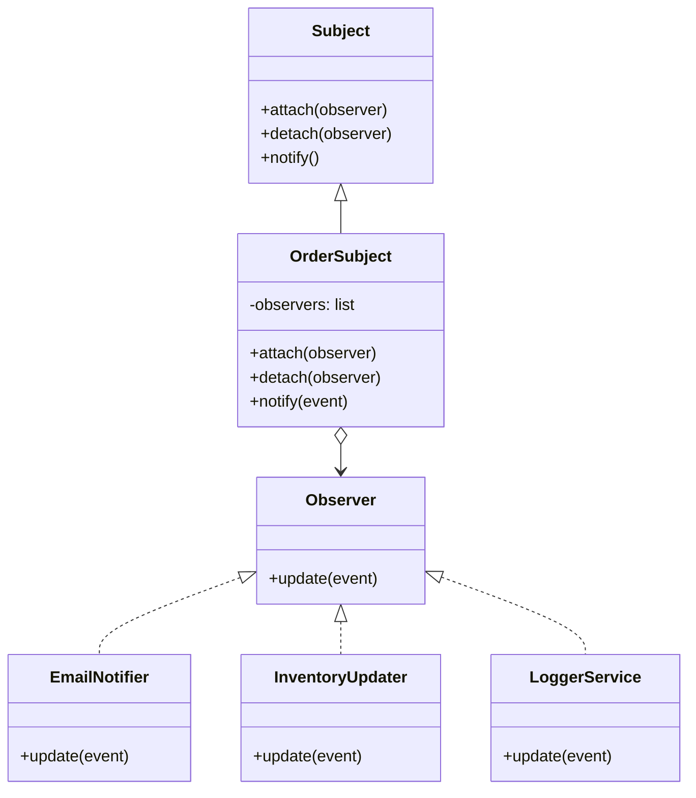
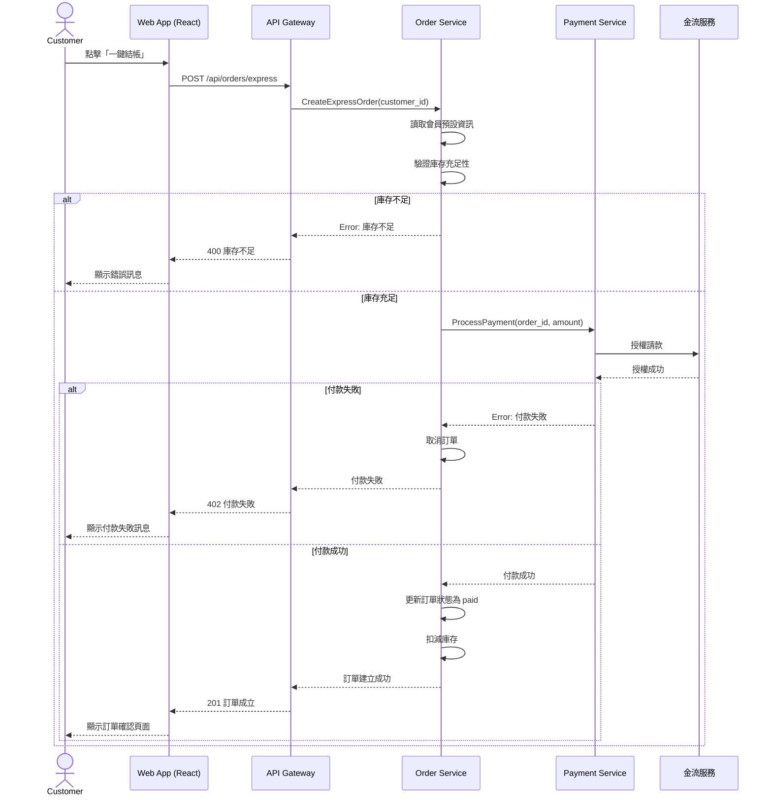
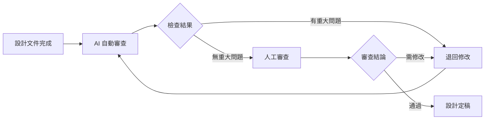

# 第 9 章：AI 與系統設計

如果系統分析回答的是「系統要做什麼」，系統設計回答的則是「系統怎麼做」。設計階段將需求轉化為具體的技術方案，涵蓋架構、資料庫、API、元件互動等面向。AI 在設計階段的角色不僅是生成文件，更能提供設計建議、評估權衡、甚至自動產生可執行的設計產物。

本章將探討 AI 如何在架構設計、資料庫設計、API 設計、設計模式套用、系統設計文件生成與設計審查中提供具體協助。

## 9.1 AI 輔助架構設計

架構設計是系統設計中最關鍵也最具挑戰性的環節。一個好的架構需要考量功能需求、非功能需求、團隊能力、營運成本等多個維度。AI 可以成為架構師的「第二個大腦」，提供多種方案並分析權衡。

### 9.1.1 架構風格推薦

不同的系統適合不同的架構風格。AI 可以根據需求特徵推薦最合適的架構風格。

```python
import json
from openai import OpenAI

client = OpenAI()

def recommend_architecture(requirements: list[dict], constraints: dict) -> dict:
    prompt = f"""你是一位資深軟體架構師。請根據以下需求與限制條件，推薦最適合的架構風格。

功能需求：
{json.dumps(requirements, indent=2, ensure_ascii=False)}

非功能需求與限制：
{json.dumps(constraints, indent=2, ensure_ascii=False)}

請以 JSON 格式輸出：
{{
    "recommended_style": "微服務 / 模組化單體 / 事件驅動 / 分層架構 / 六角形架構 ...",
    "alternatives": ["其他可行方案"],
    "reasoning": "選擇的理由",
    "trade_offs": {{
        "優點": ["..."],
        "缺點": ["..."]
    }},
    "key_concerns": ["實作時需要注意的事項"]
}}
"""
    response = client.chat.completions.create(
        model="gpt-4",
        messages=[{"role": "user", "content": prompt}],
        response_format={"type": "json_object"}
    )
    return json.loads(response.choices[0].message.content)
```

使用範例：

```python
requirements = [
    {"id": "FR-001", "description": "使用者可以瀏覽商品目錄", "priority": "high"},
    {"id": "FR-002", "description": "使用者可以下訂單並付款", "priority": "high"},
    {"id": "FR-003", "description": "管理員可以管理商品庫存", "priority": "medium"},
]

constraints = {
    "expected_users": "10 萬 DAU",
    "team_size": "6 人",
    "timeline": "4 個月",
    "scalability_requirement": "需支援未來 3 年 5 倍流量成長",
    "deployment": "AWS 雲端部署"
}

result = recommend_architecture(requirements, constraints)
print(json.dumps(result, indent=2, ensure_ascii=False))
```

可能的輸出：

```json
{
  "recommended_style": "模組化單體 (Modular Monolith)",
  "alternatives": ["微服務架構", "分層架構"],
  "reasoning": "團隊規模僅 6 人且開發時程僅 4 個月，微服務的維運負擔過高。模組化單體在初期可快速交付，同時透過明確的模組邊界保留未來拆分為微服務的彈性。",
  "trade_offs": {
    "優點": [
      "開發速度快，部署簡單",
      "團隊溝通成本低",
      "適合初期不確定性高的階段",
      "後續可逐步拆分成微服務"
    ],
    "缺點": [
      "無法獨立擴展單一模組",
      "技術棧綁定",
      "長期來說可能出現模組耦合"
    ]
  },
  "key_concerns": [
    "需嚴格定義模組邊界與介面",
    "模組間禁止直接依賴具體實作",
    "建立完善的 CI/CD 流程確保品質"
  ]
}
```

### 9.1.2 架構決策記錄 (ADR) 生成

架構決策記錄 (Architecture Decision Record, ADR) 是記錄架構選擇與其理由的重要文件。AI 可以根據決策上下文自動生成 ADR。

```python
def generate_adr(title: str, context: str, options: list[dict], decision: str) -> str:
    prompt = f"""請根據以下資訊產生一份架構決策記錄 (ADR)。

使用 Markdown 格式，遵循下列模板：
# ADR-{下一編號}: {標題}

## 狀態
[提案中 / 已接受 / 已取代]

## 背景
[決策上下文與動機]

## 選項
[比較各個方案的優缺點]

## 決策
[選擇的方案]

## 理由
[選擇此方案的原因]

## 影響
[此決策帶來的正面與負面影響]

## 相關 ADR
[若有相關決策請列出]

---
決策標題：{title}
決策背景：{context}
考慮選項：{json.dumps(options, indent=2, ensure_ascii=False)}
最終決定：{decision}
"""
    response = client.chat.completions.create(
        model="gpt-4",
        messages=[{"role": "user", "content": prompt}]
    )
    return response.choices[0].message.content
```

ADR 產出範例：

```markdown
# ADR-001: 採用模組化單體架構

## 狀態
已接受

## 背景
我們正在開發一個電商平台 MVP，團隊 6 人，預計 4 個月內上線。
由於團隊規模小且時程緊湊，需要一個能快速交付但不失未來擴展性的架構方案。

## 選項

| 方案 | 優點 | 缺點 |
|------|------|------|
| 微服務架構 | 獨立部署、獨立擴展、技術多樣性 | 維運複雜度高、團隊分工困難、開發速度較慢 |
| 模組化單體 | 開發快速、部署簡單、保留拆分彈性 | 無法獨立擴展、長期可能耦合 |
| 無伺服器 (Serverless) | 免維運、自動擴展 | 冷啟動問題、供應商鎖定、不適合長時間運算 |

## 決策
採用模組化單體 (Modular Monolith)。

## 理由
1. 團隊規模與時程不支援微服務的基礎設施成本
2. MVP 階段需求變化大，需快速迭代
3. 透過 strict module boundary 保留未來拆分為微服務的技術路徑
4. 單體部署在初期可減少 DevOps 負擔

## 影響
正面：開發速度提升 30%-50%，部署流程簡單
負面：一年後若流量大幅成長可能需要架構遷移

## 相關 ADR
無
```

### 9.1.3 架構評估與權衡分析

對於複雜的架構決策，AI 可以從多個維度進行量化評估。

```python
def architecture_tradeoff_analysis(options: list[dict], criteria: list[str]) -> str:
    prompt = f"""請對以下架構方案進行權衡分析。

方案：
{json.dumps(options, indent=2, ensure_ascii=False)}

評估維度：{', '.join(criteria)}

請使用 Weighted Scoring Model，每個維度 1-5 分，並附上理由。
最後建議最佳方案。
"""
    response = client.chat.completions.create(
        model="gpt-4",
        messages=[{"role": "user", "content": prompt}]
    )
    return response.choices[0].message.content
```

## 9.2 資料庫設計

AI 可以從需求規格與領域模型中推論出資料庫 Schema、建議索引策略、最佳化查詢，甚至生成遷移腳本。

### 9.2.1 Schema 設計

從領域模型自動生成資料庫 Schema：

```python
def generate_db_schema(domain_model: dict, db_type: str = "postgresql") -> str:
    prompt = f"""請根據以下領域模型，產生 {db_type} 的資料庫 Schema。

領域模型：
{json.dumps(domain_model, indent=2, ensure_ascii=False)}

請包含：
1. 所有表格定義（含欄位名稱、型別、約束條件）
2. 主鍵與外鍵定義
3. 索引建議
4. 若適用，提供 JSON Schema 或 migration SQL

以 SQL DDL 語句輸出。
"""
    response = client.chat.completions.create(
        model="gpt-4",
        messages=[{"role": "user", "content": prompt}]
    )
    return response.choices[0].message.content
```

假設領域模型包含 Customer、Order、OrderItem、Product，AI 可能產出以下 SQL：

```sql
-- 電商平台資料庫 Schema

CREATE EXTENSION IF NOT EXISTS "uuid-ossp";

CREATE TABLE customers (
    customer_id UUID PRIMARY KEY DEFAULT uuid_generate_v4(),
    email VARCHAR(255) NOT NULL UNIQUE,
    name VARCHAR(100) NOT NULL,
    member_level VARCHAR(20) DEFAULT 'regular',
    annual_spending DECIMAL(10, 2) DEFAULT 0.00,
    created_at TIMESTAMP WITH TIME ZONE DEFAULT NOW(),
    updated_at TIMESTAMP WITH TIME ZONE DEFAULT NOW()
);

CREATE TABLE products (
    product_id UUID PRIMARY KEY DEFAULT uuid_generate_v4(),
    name VARCHAR(200) NOT NULL,
    description TEXT,
    price DECIMAL(10, 2) NOT NULL CHECK (price >= 0),
    stock_quantity INTEGER NOT NULL DEFAULT 0 CHECK (stock_quantity >= 0),
    category VARCHAR(100),
    weight_grams INTEGER,
    created_at TIMESTAMP WITH TIME ZONE DEFAULT NOW()
);

CREATE TABLE orders (
    order_id UUID PRIMARY KEY DEFAULT uuid_generate_v4(),
    customer_id UUID NOT NULL REFERENCES customers(customer_id),
    status VARCHAR(20) NOT NULL DEFAULT 'pending'
        CHECK (status IN ('pending', 'paid', 'shipped', 'delivered', 'cancelled')),
    total_amount DECIMAL(10, 2) NOT NULL CHECK (total_amount >= 0),
    shipping_fee DECIMAL(10, 2) NOT NULL DEFAULT 0.00,
    shipping_address TEXT NOT NULL,
    created_at TIMESTAMP WITH TIME ZONE DEFAULT NOW(),
    paid_at TIMESTAMP WITH TIME ZONE,
    shipped_at TIMESTAMP WITH TIME ZONE
);

CREATE TABLE order_items (
    order_item_id UUID PRIMARY KEY DEFAULT uuid_generate_v4(),
    order_id UUID NOT NULL REFERENCES orders(order_id) ON DELETE CASCADE,
    product_id UUID NOT NULL REFERENCES products(product_id),
    quantity INTEGER NOT NULL CHECK (quantity > 0),
    unit_price DECIMAL(10, 2) NOT NULL CHECK (unit_price >= 0)
);

-- 索引
CREATE INDEX idx_orders_customer_id ON orders(customer_id);
CREATE INDEX idx_orders_status ON orders(status);
CREATE INDEX idx_orders_created_at ON orders(created_at);
CREATE INDEX idx_order_items_order_id ON order_items(order_id);
CREATE INDEX idx_products_category ON products(category);
CREATE INDEX idx_products_name_search ON products USING gin(to_tsvector('english', name));
CREATE INDEX idx_customers_email ON customers(email);
CREATE INDEX idx_customers_member_level ON customers(member_level);
```

### 9.2.2 索引策略建議

AI 可以根據查詢模式分析並提出索引策略。

```python
def analyze_index_strategy(schema: str, query_patterns: list[str]) -> str:
    prompt = f"""你是一位資料庫效能專家。請根據以下 Schema 與查詢模式進行索引分析。

Schema：
{schema}

預期查詢模式：
{json.dumps(query_patterns, indent=2, ensure_ascii=False)}

請輸出：
1. 建議建立的索引（含複合索引建議）
2. 索引覆蓋分析（哪些查詢可被索引完全覆蓋）
3. 需要避免的索引（重複或低選擇性索引）
4. 預期的效能提升估計
"""
    response = client.chat.completions.create(
        model="gpt-4",
        messages=[{"role": "user", "content": prompt}]
    )
    return response.choices[0].message.content


query_patterns = [
    "根據 customer_id 查詢該客戶最近 30 天的訂單",
    "根據訂單狀態與建立時間範圍查詢訂單",
    "根據商品名稱關鍵字搜尋商品",
    "統計各會員等級的客戶數量"
]
```

### 9.2.3 查詢最佳化

```python
def optimize_query(query: str, schema: str, explain_output: str = "") -> str:
    prompt = f"""請最佳化以下 SQL 查詢。

Schema：
{schema}

原始查詢：
{query}

執行計畫：
{explain_output if explain_output else "無"}

請輸出：
1. 最佳化後的查詢語句
2. 最佳化說明（為什麼這樣改更快）
3. 需要建立的索引（若有）
"""
    response = client.chat.completions.create(
        model="gpt-4",
        messages=[{"role": "user", "content": prompt}]
    )
    return response.choices[0].message.content
```

範例：最佳化一個常見的報表查詢

```sql
-- 原始查詢：查詢每個商品類別的月銷售統計
SELECT
    p.category,
    DATE_TRUNC('month', o.created_at) AS month,
    COUNT(DISTINCT o.order_id) AS order_count,
    SUM(oi.quantity) AS units_sold,
    SUM(oi.quantity * oi.unit_price) AS revenue
FROM products p
JOIN order_items oi ON p.product_id = oi.product_id
JOIN orders o ON oi.order_id = o.order_id
WHERE o.status = 'delivered'
  AND o.created_at >= '2025-01-01'
GROUP BY p.category, DATE_TRUNC('month', o.created_at)
ORDER BY p.category, month;
```

AI 可能建議建立覆蓋索引並改寫查詢：

```sql
-- 最佳化建議：
-- 1. 建立複合索引：orders (status, created_at) INCLUDE (order_id)
-- 2. 建立複合索引：order_items (order_id, product_id, quantity, unit_price)
-- 3. 若 category 選擇性高，可考慮 partitioning by month

CREATE INDEX idx_orders_status_date ON orders(status, created_at) INCLUDE (order_id);
CREATE INDEX idx_order_items_detail ON order_items(order_id, product_id, quantity, unit_price);

EXPLAIN ANALYZE
SELECT
    p.category,
    DATE_TRUNC('month', o.created_at) AS month,
    COUNT(DISTINCT o.order_id) AS order_count,
    SUM(oi.quantity) AS units_sold,
    SUM(oi.quantity * oi.unit_price) AS revenue
FROM products p
JOIN order_items oi ON p.product_id = oi.product_id
JOIN orders o ON oi.order_id = o.order_id
WHERE o.status = 'delivered'
  AND o.created_at >= '2025-01-01'
GROUP BY p.category, DATE_TRUNC('month', o.created_at)
ORDER BY p.category, month;
```

### 9.2.4 遷移腳本生成

AI 可以從 Schema 變更需求自動生成資料庫遷移腳本，並確保向下相容。

```python
def generate_migration(current_schema: str, target_schema: str, db_type: str = "postgresql") -> str:
    prompt = f"""請根據目前的 Schema 與目標 Schema 的差異，生成資料庫遷移腳本。

當前 Schema：
{current_schema}

目標 Schema：
{target_schema}

資料庫型別：{db_type}

請輸出：
1. 向上遷移腳本 (Up Migration)
2. 向下遷移腳本 (Down Migration) — 用於回滾
3. 遷移注意事項（如資料遷移、停機時間、向下相容性）
"""
    response = client.chat.completions.create(
        model="gpt-4",
        messages=[{"role": "user", "content": prompt}]
    )
    return response.choices[0].message.content
```

遷移腳本範例：

```sql
-- Up Migration: 新增會員分級功能
-- Version: 002_add_member_levels

ALTER TABLE customers
ADD COLUMN member_level VARCHAR(20) NOT NULL DEFAULT 'regular',
ADD COLUMN annual_spending DECIMAL(10, 2) NOT NULL DEFAULT 0.00,
ADD COLUMN member_since TIMESTAMP WITH TIME ZONE DEFAULT NOW();

-- 建立會員等級更新觸發器
CREATE OR REPLACE FUNCTION update_member_level()
RETURNS TRIGGER AS $$
BEGIN
    IF NEW.annual_spending >= 30000 THEN
        NEW.member_level := 'gold';
    ELSIF NEW.annual_spending >= 10000 THEN
        NEW.member_level := 'silver';
    ELSE
        NEW.member_level := 'regular';
    END IF;
    RETURN NEW;
END;
$$ LANGUAGE plpgsql;

CREATE TRIGGER trg_update_member_level
    BEFORE UPDATE OF annual_spending ON customers
    FOR EACH ROW
    EXECUTE FUNCTION update_member_level();

-- Down Migration
DROP TRIGGER IF EXISTS trg_update_member_level ON customers;
DROP FUNCTION IF EXISTS update_member_level();
ALTER TABLE customers
DROP COLUMN IF EXISTS member_level,
DROP COLUMN IF EXISTS annual_spending,
DROP COLUMN IF EXISTS member_since;
```

## 9.3 API 設計

API 是系統的門面，良好的 API 設計直接影響開發者體驗與系統整合效率。AI 可以在多種 API 風格中提供設計建議。

### 9.3.1 RESTful API 設計

```python
def design_restful_api(entity_name: str, operations: list[str]) -> str:
    prompt = f"""請為實體「{entity_name}」設計 RESTful API，支援以下操作：
{json.dumps(operations, indent=2, ensure_ascii=False)}

請輸出：
1. 資源 URI 設計
2. HTTP 方法與對應操作
3. 請求/回應格式（JSON）
4. 狀態碼使用
5. 錯誤回應格式
6. 篩選、排序、分頁設計

以表格與 JSON 範例呈現。
"""
    response = client.chat.completions.create(
        model="gpt-4",
        messages=[{"role": "user", "content": prompt}]
    )
    return response.choices[0].message.content
```

AI 生成的 RESTful API 設計範例：

```
## Order API 設計

### 資源結構

```
/orders                    -> 訂單集合
/orders/{order_id}         -> 單一訂單
/orders/{order_id}/items   -> 訂單項目集合
/customers/{id}/orders     -> 客戶的訂單
```

### API 端點

| 方法 | URI | 操作 | 狀態碼 |
|------|-----|------|--------|
| GET | /orders | 列出訂單（分頁） | 200 |
| POST | /orders | 建立訂單 | 201 |
| GET | /orders/{id} | 取得訂單詳情 | 200 |
| PUT | /orders/{id} | 更新訂單 | 200 |
| PATCH | /orders/{id}/status | 更新訂單狀態 | 200 |
| DELETE | /orders/{id} | 取消訂單 | 204 |

### 請求/回應範例

```json
// POST /orders
{
    "customer_id": "uuid",
    "shipping_address": {
        "street": "忠孝東路 100 號",
        "city": "台北市",
        "zipcode": "100"
    },
    "items": [
        {"product_id": "uuid1", "quantity": 2},
        {"product_id": "uuid2", "quantity": 1}
    ]
}

// 201 Created
{
    "order_id": "uuid",
    "status": "pending",
    "total_amount": 1500.00,
    "shipping_fee": 100.00,
    "estimated_delivery": "2026-04-01",
    "created_at": "2026-03-25T10:30:00Z",
    "_links": {
        "self": {"href": "/orders/uuid"},
        "payment": {"href": "/orders/uuid/payment"},
        "customer": {"href": "/customers/uuid"}
    }
}
```

### 篩選、排序、分頁

```
GET /orders?status=paid&created_at.gte=2026-01-01&sort=-created_at&page=1&per_page=20
```

### 錯誤回應格式

```json
{
    "error": {
        "code": "ORDER_NOT_FOUND",
        "message": "訂單不存在",
        "details": {"order_id": "invalid-uuid"}
    }
}
```
```

### 9.3.2 GraphQL Schema 生成

```python
def generate_graphql_schema(domain_model: dict) -> str:
    prompt = f"""請根據以下領域模型，產生 GraphQL Schema。

領域模型：
{json.dumps(domain_model, indent=2, ensure_ascii=False)}

請包含：
1. Type 定義
2. Query 與 Mutation
3. Input 型別
4. 訂閱 (Subscription) 若有需要
5. Resolver 簽名

使用 GraphQL SDL 語法輸出。
"""
    response = client.chat.completions.create(
        model="gpt-4",
        messages=[{"role": "user", "content": prompt}]
    )
    return response.choices[0].message.content
```

GraphQL Schema 範例：

```graphql
type Query {
    order(id: ID!): Order
    orders(status: OrderStatus, first: Int, after: String): OrderConnection
    customer(id: ID!): Customer
    customerOrders(customerId: ID!, first: Int, after: String): OrderConnection
    products(category: String, first: Int, after: String): ProductConnection
    product(id: ID!): Product
}

type Mutation {
    createOrder(input: CreateOrderInput!): OrderPayload!
    updateOrderStatus(id: ID!, status: OrderStatus!): OrderPayload!
    cancelOrder(id: ID!): OrderPayload!
    createProduct(input: CreateProductInput!): ProductPayload!
    updateStock(id: ID!, quantity: Int!): ProductPayload!
}

type Subscription {
    orderStatusChanged(orderId: ID!): Order
    lowStockAlert(productId: ID!): Product
}

type Order {
    id: ID!
    customer: Customer!
    status: OrderStatus!
    totalAmount: Float!
    shippingFee: Float!
    items: [OrderItem!]!
    createdAt: DateTime!
    paidAt: DateTime
    shippedAt: DateTime
}

type OrderItem {
    id: ID!
    product: Product!
    quantity: Int!
    unitPrice: Float!
}

type Customer {
    id: ID!
    name: String!
    email: String!
    memberLevel: MemberLevel!
    annualSpending: Float!
    orders(first: Int, after: String): OrderConnection!
}

type Product {
    id: ID!
    name: String!
    description: String
    price: Float!
    stockQuantity: Int!
    category: String!
}

enum OrderStatus { PENDING PAID SHIPPED DELIVERED CANCELLED }
enum MemberLevel { REGULAR SILVER GOLD }

input CreateOrderInput {
    customerId: ID!
    shippingAddress: AddressInput!
    items: [OrderItemInput!]!
}

input AddressInput {
    street: String!
    city: String!
    zipcode: String!
}

input OrderItemInput {
    productId: ID!
    quantity: Int!
}

# 分頁類型
type OrderConnection {
    edges: [OrderEdge!]!
    pageInfo: PageInfo!
}

type OrderEdge {
    node: Order!
    cursor: String!
}

type PageInfo {
    hasNextPage: Boolean!
    hasPreviousPage: Boolean!
    startCursor: String
    endCursor: String
}
```

### 9.3.3 gRPC 協定設計

```python
def design_grpc_service(domain_model: dict) -> str:
    prompt = f"""請根據以下領域模型，設計 gRPC 服務與 Protocol Buffers 定義。

領域模型：
{json.dumps(domain_model, indent=2, ensure_ascii=False)}

請輸出 .proto 檔案內容，包含：
1. service 定義
2. message 定義
3. enum 定義
4. 支援 streaming 的考量
"""
    response = client.chat.completions.create(
        model="gpt-4",
        messages=[{"role": "user", "content": prompt}]
    )
    return response.choices[0].message.content
```

gRPC proto 範例：

```protobuf
syntax = "proto3";

package ecommerce.v1;

import "google/protobuf/timestamp.proto";
import "google/protobuf/empty.proto";

service OrderService {
    rpc CreateOrder(CreateOrderRequest) returns (Order);
    rpc GetOrder(GetOrderRequest) returns (Order);
    rpc ListOrders(ListOrdersRequest) returns (stream Order);
    rpc UpdateOrderStatus(UpdateOrderStatusRequest) returns (Order);
    rpc CancelOrder(CancelOrderRequest) returns (google.protobuf.Empty);
    rpc WatchOrderStatus(GetOrderRequest) returns (stream OrderStatusEvent);
}

message Order {
    string order_id = 1;
    string customer_id = 2;
    OrderStatus status = 3;
    double total_amount = 4;
    double shipping_fee = 5;
    Address shipping_address = 6;
    repeated OrderItem items = 7;
    google.protobuf.Timestamp created_at = 8;
    google.protobuf.Timestamp paid_at = 9;
}

message OrderItem {
    string product_id = 1;
    string product_name = 2;
    int32 quantity = 3;
    double unit_price = 4;
}

message Address {
    string street = 1;
    string city = 2;
    string zipcode = 3;
}

enum OrderStatus {
    ORDER_STATUS_UNSPECIFIED = 0;
    PENDING = 1;
    PAID = 2;
    SHIPPING = 3;
    DELIVERED = 4;
    CANCELLED = 5;
}

message CreateOrderRequest {
    string customer_id = 1;
    Address shipping_address = 2;
    repeated CreateOrderItem items = 3;
}

message CreateOrderItem {
    string product_id = 1;
    int32 quantity = 2;
}

message GetOrderRequest {
    string order_id = 1;
}

message ListOrdersRequest {
    string customer_id = 1;
    OrderStatus status_filter = 2;
    int32 page_size = 3;
    string page_token = 4;
}

message UpdateOrderStatusRequest {
    string order_id = 1;
    OrderStatus new_status = 2;
}

message CancelOrderRequest {
    string order_id = 1;
    string reason = 2;
}

message OrderStatusEvent {
    string order_id = 1;
    OrderStatus old_status = 2;
    OrderStatus new_status = 3;
    google.protobuf.Timestamp timestamp = 4;
}
```

### 9.3.4 API 版本策略

```python
def recommend_api_versioning(api_context: str) -> str:
    prompt = f"""根據以下 API 設計的上下文，建議 API 版本策略。

{api_context}

請分析：
1. URI 版本 vs Header 版本 vs Query Parameter 版本
2. 建議的版本策略
3. 版本生命週期管理（廢棄、淘汰流程）
4. 向後相容性檢查清單
"""
    response = client.chat.completions.create(
        model="gpt-4",
        messages=[{"role": "user", "content": prompt}]
    )
    return response.choices[0].message.content
```

## 9.4 設計模式應用

設計模式是經過驗證的解決方案，但選擇正確的模式並正確實作並不容易。AI 可以根據場景推薦模式、生成實作、並偵測反模式。

### 9.4.1 場景推薦

```python
def recommend_design_pattern(problem_description: str, context: str) -> dict:
    prompt = f"""你是一位設計模式專家。分析以下問題場景並推薦最適合的設計模式。

問題描述：{problem_description}
上下文限制：{context}

請以 JSON 輸出：
{{
    "recommended_pattern": "模式名稱",
    "pattern_type": "Creational/Structural/Behavioral",
    "reasoning": "為什麼適合這個模式",
    "alternatives": ["其他可行模式"],
    "implementation_tips": ["實作要點"],
    "code_example": "簡短的概念驗證程式碼（Python）"
}}
"""
    response = client.chat.completions.create(
        model="gpt-4",
        messages=[{"role": "user", "content": prompt}],
        response_format={"type": "json_object"}
    )
    return json.loads(response.choices[0].message.content)


# 範例：多種金流服務整合
problem = """
系統需要整合多種金流服務（綠界、藍新、PayPal），
每種金流的 API 格式與簽章方式都不同。
未來可能還會加入新的金流服務。
"""

context = "團隊熟悉 Python，系統使用 FastAPI，需保持程式碼可測試性"

result = recommend_design_pattern(problem, context)
print(json.dumps(result, indent=2, ensure_ascii=False))
```

可能的輸出：

```json
{
  "recommended_pattern": "Strategy Pattern",
  "pattern_type": "Behavioral",
  "reasoning": "每種金流服務的付款、退款、查詢邏輯不同，但流程結構相同。Strategy Pattern 可將每種金流實作封裝成獨立的策略類別，用戶端透過統一介面呼叫。新增金流只需新增策略類別，符合開放封閉原則。",
  "alternatives": ["Factory Method", "Facade Pattern"],
  "implementation_tips": [
    "定義 PaymentStrategy 抽象介面，包含 pay(), refund(), query() 等方法",
    "每個金流實作自己的策略類別",
    "使用 Factory 或 DI Container 根據設定選擇策略",
    "策略類別應為無狀態 (stateless) 以便共用"
  ],
  "code_example": "from abc import ABC, abstractmethod\n\nclass PaymentStrategy(ABC):\n    @abstractmethod\n    def pay(self, amount: float, order_id: str) -> dict: ...\n\nclass EcpayStrategy(PaymentStrategy):\n    def pay(self, amount: float, order_id: str) -> dict:\n        # 綠界 API 實作\n        return {'status': 'success', 'transaction_id': '...'}\n\nclass NewebpayStrategy(PaymentStrategy):\n    def pay(self, amount: float, order_id: str) -> dict:\n        # 藍新 API 實作\n        return {'status': 'success', 'transaction_id': '...'}\n\nclass PaymentService:\n    def __init__(self, strategy: PaymentStrategy):\n        self._strategy = strategy\n    \n    def process_payment(self, amount: float, order_id: str) -> dict:\n        return self._strategy.pay(amount, order_id)"
}
```

### 9.4.2 實作生成

AI 不僅能推薦模式，還能根據模式名稱與需求生成完整的實作程式碼。

```python
def generate_pattern_implementation(pattern_name: str, requirements: str, language: str = "python") -> str:
    prompt = f"""請使用 {language} 實作 {pattern_name} 設計模式。

需求說明：
{requirements}

請輸出：
1. 完整的實作程式碼
2. 類別圖（Mermaid 格式）
3. 使用範例
4. 單元測試重點
"""
    response = client.chat.completions.create(
        model="gpt-4",
        messages=[{"role": "user", "content": prompt}]
    )
    return response.choices[0].message.content
```

範例：AI 生成的 Observer Pattern 實作：



```python
from abc import ABC, abstractmethod
from dataclasses import dataclass
from typing import Any, Callable


@dataclass
class Event:
    type: str
    data: dict[str, Any]


class Observer(ABC):
    @abstractmethod
    def update(self, event: Event) -> None: ...


class Subject(ABC):
    @abstractmethod
    def attach(self, observer: Observer) -> None: ...
    @abstractmethod
    def detach(self, observer: Observer) -> None: ...
    @abstractmethod
    def notify(self, event: Event) -> None: ...


class OrderSubject(Subject):
    def __init__(self):
        self._observers: list[Observer] = []

    def attach(self, observer: Observer) -> None:
        self._observers.append(observer)

    def detach(self, observer: Observer) -> None:
        self._observers.remove(observer)

    def notify(self, event: Event) -> None:
        for observer in self._observers:
            observer.update(event)

    def create_order(self, order_data: dict) -> None:
        # 建立訂單邏輯...
        event = Event(type="order.created", data=order_data)
        self.notify(event)


class EmailNotifier(Observer):
    def update(self, event: Event) -> None:
        if event.type == "order.created":
            print(f"發送訂單確認信至 {event.data['email']}")


class InventoryUpdater(Observer):
    def update(self, event: Event) -> None:
        if event.type == "order.created":
            for item in event.data["items"]:
                print(f"更新庫存: {item['product_id']} 減 {item['quantity']}")


# 使用範例
subject = OrderSubject()
subject.attach(EmailNotifier())
subject.attach(InventoryUpdater())

subject.create_order({
    "order_id": "ORD-001",
    "email": "customer@example.com",
    "items": [{"product_id": "P001", "quantity": 2}]
})
```

### 9.4.3 反模式偵測

AI 可以分析程式碼並識別出常見的反模式 (Anti-pattern)。

```python
def detect_anti_patterns(code: str) -> list[dict]:
    prompt = f"""請分析以下程式碼，偵測其中的設計反模式。

程式碼：
{code}

請以 JSON 格式回覆每個反模式：
{{
    "anti_patterns": [
        {{
            "name": "反模式名稱",
            "severity": "high/medium/low",
            "location": "程式碼位置（行號範圍）",
            "description": "為什麼這是反模式",
            "consequences": ["可能導致的問題"],
            "refactoring": "重構建議",
            "example": "改善後的程式碼片段"
        }}
    ]
}}
"""
    response = client.chat.completions.create(
        model="gpt-4",
        messages=[{"role": "user", "content": prompt}],
        response_format={"type": "json_object"}
    )
    return json.loads(response.choices[0].message.content).get("anti_patterns", [])
```

常見反模式偵測範例：

| 反模式 | 描述 | AI 偵測方式 | 建議修正 |
|--------|------|-------------|---------|
| God Class | 單一類別職責過多 | 分析 public method 數量與依賴注入數量 | 拆分為多個單一職責類別 |
| Spaghetti Code | 控制流程混亂 | 分析條件嵌套深度與方法長度 | 引入策略模式或狀態模式 |
| Golden Hammer | 過度使用熟悉的解決方案 | 比對問題類型與使用的模式 | 根據問題特徵選擇合適模式 |
| Copy-Paste Programming | 大量重複程式碼 | 計算程式碼相似度 | 提取共用邏輯為共用方法或類別 |

## 9.5 系統設計文件生成

系統設計文件是溝通設計決策的重要媒介。AI 可以自動生成多種視覺化設計文件。

### 9.5.1 C4 模型

C4 模型是描述軟體架構的層次化方法，包含 Context、Container、Component、Code 四個層次。AI 可以從系統描述生成 C4 模型的 Mermaid 表示。

```python
def generate_c4_model(system_description: str, level: str = "container") -> str:
    prompt = f"""請根據以下系統描述，產生 C4 模型的 {level} 層級圖（Mermaid 格式）。

系統描述：
{system_description}

輸出 Mermaid 程式碼，使用 C4 模型的標準元件：
- Person: 使用者角色
- System: 外部系統
- Container: 應用程式容器（Web App、API、資料庫等）
- Component: 容器內的元件
- Relationship: 關係描述
"""
    response = client.chat.completions.create(
        model="gpt-4",
        messages=[{"role": "user", "content": prompt}]
    )
    return response.choices[0].message.content
```

C4 Container 層級圖範例：

```mermaid
C4Context
    title System Context diagram for 電商平台

    Person(customer, "客戶", "使用平台瀏覽商品與下單")
    Person(admin, "管理員", "管理商品與訂單")

    System(ecommerce, "電商平台", "核心訂單與商品管理系統")
    System_Ext(payment, "金流服務", "處理信用卡與 ATM 付款")
    System_Ext(logistics, "物流系統", "運費計算與配送管理")
    System_Ext(email, "Email 服務", "發送訂單通知信")

    Rel(customer, ecommerce, "瀏覽、下單、查詢")
    Rel(admin, ecommerce, "管理商品與訂單")
    Rel(ecommerce, payment, "請款、退款")
    Rel(ecommerce, logistics, "運費計算、出貨")
    Rel(ecommerce, email, "訂單確認信")

C4Container
    title Container diagram for 電商平台

    System_Boundary(platform, "電商平台") {
        Container(web_app, "Web Application", "React SPA", "客戶與管理員的前端介面")
        Container(api, "API Gateway", "FastAPI", "處理所有 HTTP 請求")
        Container(order_svc, "Order Service", "Python", "訂單處理核心邏輯")
        Container(product_svc, "Product Service", "Python", "商品管理與庫存")
        Container(payment_svc, "Payment Service", "Python", "金流整合")
        ContainerDb(order_db, "Order Database", "PostgreSQL", "訂單資料儲存")
        ContainerDb(product_db, "Product Database", "PostgreSQL", "商品資料儲存")
        Container(queue, "Message Queue", "RabbitMQ", "非同步事件處理")
    }

    Rel(customer, web_app, "HTTPS")
    Rel(web_app, api, "JSON/HTTPS")
    Rel(api, order_svc, "gRPC")
    Rel(api, product_svc, "gRPC")
    Rel(order_svc, order_db, "SQL")
    Rel(product_svc, product_db, "SQL")
    Rel(order_svc, queue, "事件發布")
    Rel(payment_svc, queue, "事件消費")
    Rel(order_svc, payment, "HTTP")
```

### 9.5.2 序列圖

AI 可以根據使用案例或流程描述生成 UML 序列圖，幫助團隊理解系統的互動流程。

```python
def generate_sequence_diagram(scenario: str) -> str:
    prompt = f"""請根據以下場景描述，產生 Mermaid 序列圖。

場景：
{scenario}

請輸出 Mermaid 程式碼，展示參與者之間的互動順序。
包含條件分支與回饋迴路。
"""
    response = client.chat.completions.create(
        model="gpt-4",
        messages=[{"role": "user", "content": prompt}]
    )
    return response.choices[0].message.content
```

序列圖範例：一鍵結帳流程



### 9.5.3 架構圖生成工具整合

除了 Mermaid，AI 也可以生成其他架構圖工具的格式：

```python
def generate_architecture_diagram(description: str, format: str = "mermaid") -> str:
    """支援多種架構圖格式。"""
    prompt = f"""請根據以下架構描述產生 {format} 格式的圖表。

{description}

請只輸出圖表程式碼，不需要說明。"""
    response = client.chat.completions.create(
        model="gpt-4",
        messages=[{"role": "user", "content": prompt}]
    )
    return response.choices[0].message.content
```

## 9.6 設計審查流程

設計審查確保設計方案的品質。AI 可以在審查中提供客觀的檢查與建議。

### 9.6.1 自動化設計審查

```python
def design_review(design_doc: str, review_focus: str) -> dict:
    prompt = f"""請對以下系統設計文件進行審查。

設計文件：
{design_doc}

審查重點：{review_focus}

請以 JSON 格式輸出審查結果：
{{
    "summary": "審查摘要",
    "strengths": ["設計優點"],
    "issues": [
        {{
            "severity": "critical/major/minor",
            "category": "security/performance/scalability/maintainability/consistency",
            "description": "問題描述",
            "location": "設計文件位置",
            "recommendation": "改善建議"
        }}
    ],
    "open_questions": ["需要釐清的問題"],
    "overall_rating": "approve/conditional_approve/reject"
}}
"""
    response = client.chat.completions.create(
        model="gpt-4",
        messages=[{"role": "user", "content": prompt}],
        response_format={"type": "json_object"}
    )
    return json.loads(response.choices[0].message.content)
```

### 9.6.2 設計審查檢查清單

AI 可以根據系統特性自動生成設計審查檢查清單：

```python
def generate_review_checklist(system_type: str, architecture_style: str) -> list[str]:
    prompt = f"""請根據以下系統特性，產生一份設計審查檢查清單。

系統類型：{system_type}
架構風格：{architecture_style}

請以 JSON 陣列輸出每條檢查項目：
{{
    "checklist": [
        {{
            "id": "CHK-001",
            "category": "安全性/效能/可擴展性/可維護性/可靠性",
            "question": "檢查提問",
            "guidance": "如何驗證或判斷"
        }}
    ]
}}
"""
    response = client.chat.completions.create(
        model="gpt-4",
        messages=[{"role": "user", "content": prompt}],
        response_format={"type": "json_object"}
    )
    return json.loads(response.choices[0].message.content).get("checklist", [])
```

設計審查檢查清單範例：

| 編號 | 類別 | 檢查項目 | 驗證方式 |
|------|------|---------|---------|
| CHK-001 | 安全性 | API 是否實作認證與授權？ | 檢查 middleware 設定 |
| CHK-002 | 效能 | 資料庫查詢是否使用索引？ | 檢查 EXPLAIN PLAN |
| CHK-003 | 可擴展性 | 服務是否可水平擴展？ | 檢查有無共享狀態 |
| CHK-004 | 可維護性 | 模組間的依賴方向是否正確？ | 檢查依賴圖 |
| CHK-005 | 可靠性 | 外部服務呼叫是否有熔斷機制？ | 檢查 Circuit Breaker 實作 |

### 9.6.3 設計審查工作流程

AI 可以整合到設計審查流程中，作為初步審查的關卡：



## 本章小結

AI 在系統設計階段的應用涵蓋了從架構決策到程式碼實作的全部層次：

- **架構設計**：AI 能根據需求特徵推薦架構風格、生成 ADR、進行多維度的方案評估與權衡分析
- **資料庫設計**：從領域模型自動產生 Schema、建議索引策略、最佳化查詢、生成遷移腳本
- **API 設計**：支援 RESTful、GraphQL、gRPC 三種風格的設計，並提供版本策略建議
- **設計模式**：根據問題場景推薦合適的模式、生成完整實作、偵測反模式
- **設計文件**：自動生成 C4 模型、序列圖、架構圖等視覺化設計文件
- **設計審查**：提供自動化審查與檢查清單，提升設計品質

與系統分析階段相同，AI 在設計階段仍然是增強而非取代設計師的能力。設計的本質是取捨——在有限的時間、資源與技術限制下做出最佳選擇。AI 可以提供完整的方案分析與建議，但最終的決策權仍然在設計師手中。真正的價值來自於人機協作：設計師提出關鍵問題與方向，AI 補充足夠的技術細節與方案比較，雙方共同產出高品質的系統設計。

在下一章中，我們將進入實作階段，探討 AI 導向程式設計 (AI-Oriented Programming) 如何改變我們撰寫程式碼的方式。
