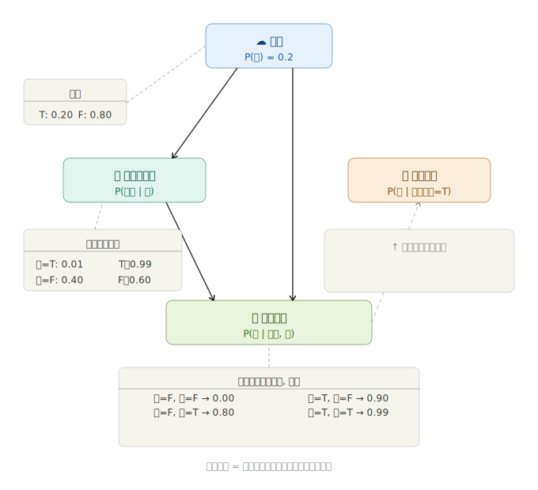

## ccc: 請寫一個貝氏網路的經典範例

以下是貝氏網路的經典範例：**草地灑水器問題（Sprinkler Problem）**，由 Judea Pearl 提出，是教學上最常用的示範。## 貝氏網路：草地灑水器問題

### 問題設定

這個網路描述三件事之間的因果關係：**下雨 → 灑水器 / 草地濕潤**。

### 節點與條件機率

**下雨**（根節點，無父節點）
- P(雨 = T) = 0.2，P(雨 = F) = 0.8

**灑水器啟動**（受下雨影響）
- 晴天時啟動機率高：P(灑水=T | 雨=F) = 0.40
- 雨天時通常關掉：P(灑水=T | 雨=T) = 0.01

**草地濕潤**（受灑水器和下雨兩者影響）

| 灑水器 | 下雨 | P(草濕=T) |
|--------|------|-----------|
| F | F | 0.00 |
| T | F | 0.90 |
| F | T | 0.80 |
| T | T | 0.99 |

---

### 推論示範

**正向推論**（已知原因，算結果）：晴天且灑水器啟動，草地有 90% 機率濕潤。

**反向推論**（已知結果，猜原因）：觀測到草地是濕的，下雨的機率是多少？

用貝氏定理計算：

> P(草濕=T) = P(草濕|灑水,雨)×P(灑水|雨)×P(雨) + ...（對所有組合求和）≈ 0.322
>
> P(雨=T | 草濕=T) = P(草濕=T|雨=T)×P(雨=T) / P(草濕=T) **≈ 0.358**

意思是：看到草地是濕的，下雨的機率從先驗的 20% 提升到了約 **36%**。

---

### 核心概念

貝氏網路由**有向無環圖（DAG）**加上每個節點的**條件機率表（CPT）**組成。它讓我們能夠：
1. 用圖形表達變數間的因果與依賴關係
2. 以模組化的方式儲存聯合機率分布
3. 高效進行正向（預測）與反向（診斷）推論

這正是它廣泛應用於醫療診斷、垃圾郵件過濾、故障排除等領域的原因。