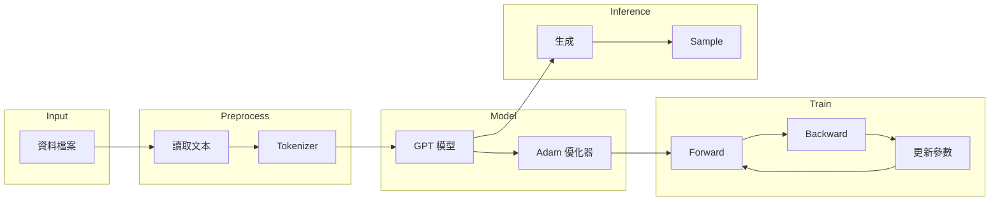

# gpt0demo.py — 教學演示

## 概述

gpt0demo.py 是一個完整的 GPT 模型訓練與推理演示程式，展示如何使用 nn0.py（自動微分引擎）和 gpt0.py（GPT 模型）來訓練一個字符級語言模型並生成文本。

這是一個端到端（End-to-End）的教學範例，涵蓋：
1. 資料載入與预处理
2. Tokenizer（分詞器）建立
3. 模型初始化
4. 訓練流程
5. 推理生成

## 執行方式

```bash
python gpt0demo.py <資料檔案>
```

例如：
```bash
python gpt0demo.py chinese.txt
```

## 程式碼詳解

### 1. 匯入模組

```python
import os
import sys
import random

from nn0 import Adam
from gpt0 import Gpt, train, inference
```

- `os`, `sys`: Python 標準庫，用於檔案操作和命令列參數
- `random`: 設定隨機種子，確保結果可重現
- `nn0`: 自動微分引擎，提供 Value 類和 Adam 優化器
- `gpt0`: GPT 模型，提供 Gpt 類和 train/inference 函式

### 2. 載入資料集

```python
data_file = sys.argv[1]  # 'chinese.txt'
docs = [line.strip() for line in open(data_file) if line.strip()]
random.shuffle(docs)
print(f"num docs: {len(docs)}")
```

#### 資料格式要求
- 每行一個句子/文檔
- 去除空白行
- 打亂順序（幫助泛化）

#### 範例資料（chinese.txt）
```
你好嗎
我很好
今天天氣很好
小明去學校
```

### 3. Tokenizer（分詞器）

```python
uchars = sorted(set(''.join(docs)))
BOS = len(uchars)
vocab_size = len(uchars) + 1
print(f"vocab size: {vocab_size}")
```

#### 字符級 Tokenizer
- 將每個字元對應到一個 ID
- 使用 `sorted` 確保順序固定
- BOS 標記表示序列開始

#### 範例
假設資料包含：`['你', '好', '嗎', '我', '很', '好', '天', '氣', '去', '學', '校']`

```
uchars = ['你', '好', '嗎', '我', '很', '天', '氣', '去', '學', '校']
BOS = 10
vocab_size = 11
```

Tokenize 範例：
- 原始：`"你好嗎"`
- Tokenized：`[10, 0, 1, 2, 10]`
  - 10 = BOS（在開頭）
  - 0 = 你
  - 1 = 好
  - 2 = 嗎
  - 10 = BOS（在結尾）

### 4. 建立模型

```python
model = Gpt(vocab_size, n_embd=16, n_layer=1, n_head=4, block_size=16)
print(f"num params: {len(model.params)}")
```

#### 超參數說明

| 參數 | 值 | 說明 |
|------|-----|------|
| vocab_size | 11 | 詞彙表大小 |
| n_embd | 16 | Embedding 維度 |
| n_layer | 1 | Transformer 層數 |
| n_head | 4 | Attention 頭數 |
| block_size | 16 | 最大上下文長度 |

#### 參數數量計算

```
Token Embedding: vocab_size × n_embd = 11 × 16 = 176
Position Embedding: block_size × n_embd = 16 × 16 = 256
LM Head: vocab_size × n_embd = 11 × 16 = 176

每層 Attention (Q, K, V, O): 4 × n_embd × n_embd = 4 × 16 × 16 = 1024
每層 MLP (fc1, fc2): 2 × n_embd × 4×n_embd = 2 × 16 × 64 = 2048

總計：176 + 256 + 176 + 1024 + 2048 = 3680
```

### 5. 建立優化器

```python
optimizer = Adam(model.params, lr=0.01)
```

#### Adam 優化器特點
- 自適應學習率
- 結合動量（Momentum）
- 比 SGD 更容易收斂

#### 學習率
- lr = 0.01 是合理的起始值
- 後續會進行線性衰減

### 6. 訓練

```python
train(model, optimizer, docs, uchars, BOS, num_steps=1000)
```

#### 訓練流程
1. 對每個文檔進行 tokenize
2. 加入 BOS 標記
3. 執行梯度下降
4. 更新參數

#### 訓練目標
對於序列 `[t0, t1, ..., tn]`：
- 輸入：`[t0, t1, ..., t(n-1)]`
- 目標：`[t1, t2, ..., tn]`
- Loss：`-log(P(t(i+1) | t0,...,ti))` 的平均

#### 學習率衰減
```python
lr_t = lr_0 * (1 - step / num_steps)
```
- 開始時：lr = 0.01
- 結束時：lr ≈ 0

### 7. 推理

```python
inference(model, uchars, BOS, num_samples=20, temperature=0.5)
```

#### 生成流程
```
1. 從 BOS 開始
2. 每一步：
   a. 前向傳播得到 logits
   b. 應用 temperature：logits / T
   c. Softmax 得到機率分布
   d. 按機率加權隨機選擇下一個 token
3. 遇到 BOS 停止
4. 輸出文本
```

#### Temperature 的影響
| Temperature | 效果 |
|-----------|------|
| T → 0 | 總是選擇最可能的 token（貪心解碼） |
| T = 1 | 原始分布 |
| T > 1 | 更多樣性，可能不太流暢 |

#### 範例輸出（訓練 1000 步後）
```
sample  1: 很好
sample  2: 我很好
sample  3: 你好嗎
sample  4: 天氣很好
sample  5: 謝謝
sample  6: 我愛你
sample  7: 很高興認識你
sample  8: 你好
sample  9: 我很好
sample 10: 很好
```

## 數學原理

### 1. 語言建模

語言模型的目標是預測下一個詞的概率：

$$
P(w_1, w_2, \ldots, w_n) = \prod_{i=1}^{n} P(w_i | w_1, \ldots, w_{i-1})
$$

### 2. Cross-Entropy Loss

訓練時使用的損失函數：

$$
\mathcal{L} = -\frac{1}{n} \sum_{i=1}^{n} \log P(w_i | w_1, \ldots, w_{i-1})
$$

### 3. Softmax

將 logits 轉換為機率分布：

$$
P(w_i) = \frac{e^{logit_i}}{\sum_j e^{logit_j}}
$$

使用最大值平移防止數值溢位。

### 4. Temperature

調整機率分布的平滑度：

$$
P_T(w_i) = \frac{e^{logit_i / T}}{\sum_j e^{logit_j / T}}
$$

### 5. Adam 優化

結合動量和 RMSProp：

$$
m_t = \beta_1 m_{t-1} + (1-\beta_1) g_t
$$
$$
v_t = \beta_2 v_{t-1} + (1-\beta_2) g_t^2
$$
$$
\hat{m}_t = \frac{m_t}{1-\beta_1^t}
$$
$$
\hat{v}_t = \frac{v_t}{1-\beta_2^t}
$$
$$
p_{t+1} = p_t - lr \cdot \frac{\hat{m}_t}{\sqrt{\hat{v}_t} + \epsilon}
$$

## 實驗建議

### 1. 調整模型大小

```python
# 更大的模型
model = Gpt(vocab_size, n_embd=64, n_layer=4, n_head=8, block_size=64)

# 更深的模型
model = Gpt(vocab_size, n_embd=32, n_layer=3, n_head=4, block_size=32)
```

### 2. 調整學習率

```python
optimizer = Adam(model.params, lr=0.001)  # 較小的學習率
optimizer = Adam(model.params, lr=0.05)  # 較大的學習率
```

### 3. 調整 Temperature

```python
inference(model, uchars, BOS, num_samples=20, temperature=0.3)  # 較確定的輸出
inference(model, uchars, BOS, num_samples=20, temperature=1.0)  # 較多樣的輸出
```

### 4. 增加訓練步數

```python
train(model, optimizer, docs, uchars, BOS, num_steps=5000)
```

## 程式架構圖



## 常見問題

### 1. Loss 不下降

可能原因：
- 學習率太小：嘗試增加 lr
- 學習率太大：嘗試減小 lr
- 模型太小：增加模型容量

### 2. 生成重複內容

可能原因：
- Temperature太低：提高 temperature
- 訓練不足：增加訓練步數

### 3. 語法不通順

這是正常的，因為：
- 模型太小
- 訓練數據不足
- 訓練步數不足

可以通過以下方式改善：
- 增加模型大小
- 增加訓練數據
- 增加訓練步數

## 參考資源

1. [GPT 原始論文](https://d4mucfpkstwa9t1k.gitbook.io/openai-gpt-2/)
2. [Transformer 論文](https://arxiv.org/abs/1706.03762)
3. [Adam 優���器��文](https://arxiv.org/abs/1412.6980)

---

本文件結束