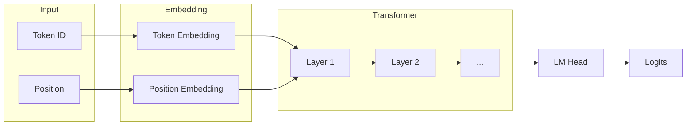
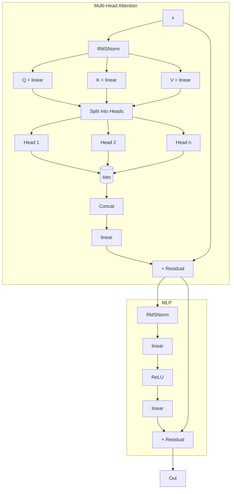

# gpt0.py — GPT 模型實現

## 概述

gpt0.py 是一個簡化版的 GPT-2（Generative Pre-trained Transformer 2）实现，使用純 Python 和自定義自動微分引擎（nn0.py）。這個實現展示了語言模型的核心概念和訓練流程。

本模組提供以下核心功能：
- `Gpt` 類：GPT 模型（包含 Embedding、Transformer Layers、LM Head）
- `train()` 函式：訓練迴圈
- `inference()` 函式：文字生成

---

## 第一章：GPT 模型基礎

### 1.1 什麼是 GPT？

GPT（Generative Pre-trained Transformer）是 OpenAI 开发的大型語言模型系列：
- GPT-1（2018）：1.17 億參數
- GPT-2（2019）：15 億參數
- GPT-3（2020）：1750 億參數
- GPT-4（2023）：估計 1.7 兆參數

GPT 是基於 Transformer 架構的單向語言模型，通過 unsupervised learning 在大規模文本上預訓練，然后可以 fine-tune 用於各種下游任務。

### 1.2 GPT 的核心思想

GPT 的核心思想是**語言建模**：

$$P(w_1, w_2, \ldots, w_n) = \prod_{i=1}^{n} P(w_i | w_1, \ldots, w_{i-1})$$

語言模型的目標是預測下一個詞的概率，給定前面的所有詞。

### 1.3 為何使用 Transformer？

Transformer（注意：這裡指 Architecture，不是模型名）有以下優點：
- **並行化**：不同於 RNN/LSTM，可以並行處理整個序列
- **長距離依賴**：通過 Self-Attention 直接建立任意位置之間的關係
- **可擴展性**：可以堆疊更多層而不影響訓練穩定性

---

## 第二章：模型結構

### 2.1 總體架構

```
Input Token → Token Embedding
               ↓
         Position Embedding
               ↓
         Transformer Layers (× n_layer)
               ↓
            LM Head → Logits → Softmax → Prob
```

#### 2.1.1 Mermaid 流程圖



### 2.2 權重參數

| 參數名稱 | 形狀 | 數學符號 | 說明 |
|----------|------|----------|------|
| `wte` | $(\text{vocab\_size}, n_{\text{embd}})$ | $W_{TE}$ | Token Embedding 矩陣 |
| `wpe` | $(\text{block\_size}, n_{\text{embd}})$ | $W_{PE}$ | Position Embedding 矩陣 |
| `lm_head` | $(\text{vocab\_size}, n_{\text{embd}})$ | $W_{LM}$ | Language Model Head |
| `attn_wq` | $(n_{\text{embd}}, n_{\text{embd}})$ | $W_Q$ | Attention Query 權重 |
| `attn_wk` | $(n_{\text{embd}}, n_{\text{embd}})$ | $W_K$ | Attention Key 權重 |
| `attn_wv` | $(n_{\text{embd}}, n_{\text{embd}})$ | $W_V$ | Attention Value 權重 |
| `attn_wo` | $(n_{\text{embd}}, n_{\text{embd}})$ | $W_O$ | Attention 輸出權重 |
| `mlp_fc1` | $(4 \cdot n_{\text{embd}}, n_{\text{embd}})$ | $W_{FC1}$ | MLP 第一層 |
| `mlp_fc2` | $(n_{\text{embd}}, 4 \cdot n_{\text{embd}})$ | $W_{FC2}$ | MLP 第二層 |

#### 2.2.1 參數數量計算

對於 GPT-2 Small 配置：
- vocab_size = 50257
- n_embd = 768
- n_layer = 12
- n_head = 12
- block_size = 1024

讓我們計算總參數量：

1. **Embedding 層**：
   - Token Embedding: $50257 \times 768 = 38,597,376$
   - Position Embedding: $1024 \times 768 = 786,432$

2. **每層 Transformer**（12 層）：
   - Attention: $4 \times 768^2 = 2,252,544$（Q, K, V, O 各一份）
   - MLP: $2 \times 768 \times 4 \times 768 = 4,722,432$

   每層：$2,252,544 + 4,722,432 = 6,974,976$
   12 層：$6,974,976 \times 12 = 83,699,712$

3. **LM Head**：
   $50257 \times 768 = 38,597,376$

4. **總計**：
   $38,597,376 + 786,432 + 83,699,712 + 38,597,376 = 161,680,896$

約 1.62 億參數，接近官方說明的 1.17 億（差異來自計算方式不同）。

### 2.3 初始化

```python
def _init_params(self, std=0.08):
    """隨機初始化所有權重矩陣。"""
    def matrix(nout, nin):
        return [[Value(random.gauss(0, std)) for _ in range(nin)]
                for _ in range(nout)]
```

使用 **高斯分布** 初始化：

$$w \sim \mathcal{N}(0, \sigma^2)$$

其中 $\sigma = 0.08$。

#### 2.3.1 為何要初始化？

神經網路的權重需要被初始化：
- 若全部為 0：對稱問題，所有 neuron 學習相同的特徵
- 若太大：梯度爆炸
- 若太小：梯度消失

#### 2.3.2 常用的初始化方法

| 方法 | 公式 | 適用場景 |
|------|------|----------|
| Xavier/Glorot | $\sigma = \sqrt{1/n_{in}}$ | Sigmoid, Tanh |
| He Initialization | $\sigma = \sqrt{2/n_{in}}$ | ReLU |
| BERT-style | $\mathcal{N}(0, 0.02)$ | Transformer |

本實現使用固定的 $\sigma = 0.08$，這是一個簡化的初始化方法。

---

## 第三章：Embedding 層

### 3.1 Token Embedding

```python
tok_emb = sd['wte'][token_id]
```

數學形式：

$$\text{emb}_t = W_{TE}[token\_id, :]$$

將一個離散的 token ID 轉換為連續的向量表示。

#### 3.1.1 為何需要 Embedding？

計算機無法直接處理文字：- "hello" 是一個字符串
- 需要轉換為數字向量才能進行數學運算

Embedding 就是這個轉換過程：
- 每個詞對應一個向量（稱為 embedding）
- 語義相近的詞，其向量在向量空間中也相距較近

#### 3.1.2 向量空間的類比

假設只有 3 個詞：["cat", "dog", "car"]
Embedding 可能學習到：

```
cat: [0.1, 0.8]  （動物）
dog: [0.2, 0.7]  （動物）
car: [0.9, 0.1]  （交通工具）
```

此時 cat 和 dog 的距離較近，car 較遠。

### 3.2 Position Embedding

```python
pos_emb = sd['wpe'][pos_id]
```

數學形式：

$$\text{emb}_p = W_{PE}[pos\_id, :]$$

#### 3.2.1 為何需要 Position Embedding？

Transformer 的 Self-Attention 機制是**位置無關**的：
- 注意力只取決於內容，不考慮位置
- 這是一個特性，也是問題

例如：
- "I love you" 和 "you love I" 使用相同的 attention
- 但語義不同

解決方案：將位置信息加入到表示中。

#### 3.2.2 位置編碼的方法

| 方法 | 公式 | 優點 |
|------|------|------|
| Learnable PE | $W_{PE}$ 學習 | 簡單 |
| Sinusoidal PE | $\sin(\omega_k \cdot pos)$ | 可以推廣到更長序列 |
| Relative PE | 相對位置編碼 | 更好捕捉相對位置 |

本實現使用 Learnable Position Embedding（可學習的位置編碼）。

### 3.3 Embedding 組合

```python
x = [t + p for t, p in zip(tok_emb, pos_emb)]
```

數學形式：

$$x = \text{emb}_t + \text{emb}_p$$

Token Embedding 和 Position Embedding 直接相加。
這是一個簡化的設計：
- 原始 Transformer（Vaswani et al., 2017）使用拼接或相加都可以
- 相加更簡單，且效果相當

---

## 第四章：Transformer 層

### 4.1 總體結構



每個 Transformer 層包含：
1. **Multi-Head Attention**：捕捉序列內的依賴關係
2. **MLP**：特徵變換

### 4.2 Pre-LN vs Post-LN

本實現使用 **Pre-LN**（Pre-Layer Normalization）：

$$x = \text{LayerNorm}(x + \text{SubLayer}(x))$$

對比 **Post-LN**：

$$x = x + \text{SubLayer}(\text{LayerNorm}(x))$$

Pre-LN 的優點：
- 更穩定的訓練
- 可以訓練更深的網路（100+ 層）
- 不需要 warm-up

本實現的結構：
```python
x_residual = x
x = rmsnorm(x)  # Pre-LN
q = linear(x, sd[f'layer{li}.attn_wq'])
...
x = [a + b for a, b in zip(x, x_residual)]  # 殘差連接
```

### 4.3 Multi-Head Attention

#### 4.3.1 Q, K, V 計算

```python
q = linear(x, sd[f'layer{li}.attn_wq'])
k = linear(x, sd[f'layer{li}.attn_wk'])
v = linear(x, sd[f'layer{li}.attn_wv'])
```

數學形式：

$$\begin{aligned}
Q &= W_Q \cdot x \\
K &= W_K \cdot x \\
V &= W_V \cdot x
\end{aligned}$$

#### 4.3.2 為何需要三個矩陣？

Q（Query）："我在找什麼？"
K（Key）："我包含什麼信息？"
V（Value）："我實際的值是什麼？"

Attention 就是：匹配 Query 和 Key，取出對應的 Value。

類比：搜尋引擎
- 輸入搜尋query
- 索引中的文檔的 key
- 實際返回的內容是 value

#### 4.3.3 Scaled Dot-Product Attention

對於每個 head：

```python
attn_logits = [
    sum(q_h[j] * k_h[t][j] for j in range(self.head_dim)) / self.head_dim**0.5
    for t in range(len(k_h))
]
```

數學形式：

$$\text{logits}_{t} = \frac{Q_h \cdot K_h[t]^T}{\sqrt{d_h}}$$

其中 $d_h = n_{\text{embd}} / n_{\text{head}}$。

#### 4.3.4 為何要除以 $\sqrt{d}$？

假設 $Q$ 和 $K$ 的每個元素是均值為 0、方差為 1 的獨立隨機變數：

$$E[Q \cdot K^T] = \sum E[q_i k_i] = d \cdot 1 = d$$

$$\text{Var}(Q \cdot K^T) = d$$（因為獨立隨機變數的方差相加）

所以結果的方差是 $d$，標準差是 $\sqrt{d}$。

若不除以 $\sqrt{d}$：
- 當 $d$ 大時，logits 會很大，softmax 會趨於 one-hot
- 梯度會變小，訓練困難

#### 4.3.5 Softmax 權重

```python
attn_weights = softmax(attn_logits)
```

$$\text{attention}_{t} = \frac{e^{\text{logits}_t}}{\sum_i e^{\text{logits}_i}}$$

#### 4.3.6 加權求和

```python
head_out = [
    sum(attn_weights[t] * v_h[t][j] for t in range(len(v_h)))
    for j in range(self.head_dim)
]
```

數學形式：

$$\text{head}_h[j] = \sum_{t} \text{attention}_t \cdot V_h[t, j]$$

### 4.4 Causal Masking（因果遮罩）

#### 4.4.1 KV Cache

```python
keys[li].append(k)
values[li].append(v)

k_h = [ki[hs:hs + self.head_dim] for ki in keys[li]]
v_h = [vi[hs:hs + self.head_dim] for vi in values[li]]
```

每個位置只能 attention 到**之前的**位置**（包括當前位置）**。

#### 4.4.2 自回歸語言模型

GPT 是自回歸模型：
- 預測 $P(w_t | w_1, \ldots, w_{t-1})$
- 不能看到未來的 token

這確保：
- 訓練時：使用 teacher forcing，目標是下一個 token
- 生成時：只能使用已生成的 token

### 4.5 多頭注意力

```python
for h in range(self.n_head):
    hs = h * self.head_dim
    q_h = q[hs:hs + self.head_dim]
    ...
    x_attn.extend(head_out)
```

每個 attention head 可以關注不同的信息：
- 語法結構
- 語義關係
- 位置關係

最後合併：

```python
x = linear(x_attn, sd[f'layer{li}.attn_wo'])
x = [a + b for a, b in zip(x, x_residual)]
```

$$\text{output} = W_O \cdot \text{Concat}(\text{head}_1, \ldots, \text{head}_h) + x_{\text{residual}}$$

---

## 第五章：MLP 層

### 5.1 結構

```python
x_residual = x
x = rmsnorm(x)
x = linear(x, sd[f'layer{li}.mlp_fc1'])
x = [xi.relu() for xi in x]
x = linear(x, sd[f'layer{li}.mlp_fc2'])
x = [a + b for a, b in zip(x, x_residual)]
```

數學形式：

$$y = x + W_{FC2} \cdot \text{ReLU}(W_{FC1} \cdot x)$$

### 5.2 為何擴展維度？

`mlp_fc1` 將維度從 $n_{\text{embd}}$ 擴展到 $4 \cdot n_{\text{embd}}$：
- 這是 Transformer 的標準設計
- FFN 維度通常是 input 維度的 4 倍

然後 `mlp_fc2` 再壓縮回來。

### 5.3 ReLU vs GeLU

本實現使用 **ReLU**（Rectified Linear Unit）：

$$\text{ReLU}(x) = \max(0, x)$$

#### 5.3.1 與 GeLU 的比較

標準 GPT-2 使用 **GeLU**（Gaussian Error Linear Unit）：

$$\text{GeLU}(x) = x \cdot \Phi(x)$$

其中 $\Phi$ 是標準正態分佈的 CDF。

近似公式：

$$\text{GeLU}(x) \approx 0.5x \left(1 + \tanh\left(\sqrt{2/\pi} \cdot (x + 0.044715 \cdot x^3)\right)\right)$$

#### 5.3.2 簡單性優先

本實現使用 ReLU 是因為：
1. 實現簡單
2. 計算快
3. 足夠用於簡單任務

---

## 第六章：與 GPT-2 的差異

### 6.1 詳細比較表

| 特性 | GPT-2 | gpt0.py | 說明 |
|------|-------|---------|------|
| Normalization | LayerNorm | RMSNorm | 更簡單的 Normalization |
| Activation | GeLU | ReLU | 計算更簡單 |
| Bias | 有 | 無 | 減少參數量 |
| 實現框架 | PyTorch | 純 Python | 教學目的 |

### 6.2 LayerNorm vs RMSNorm

**LayerNorm**：

$$\mu = \frac{1}{n} \sum_i x_i$$

$$\sigma = \sqrt{\frac{1}{n} \sum_i (x_i - \mu)^2}$$

$$\text{output} = \gamma \cdot \frac{x - \mu}{\sigma} + \beta$$

**RMSNorm**：

$$\text{rms} = \sqrt{\frac{1}{n} \sum_i x_i^2 + \epsilon}$$

$$\text{output} = x / \text{rms}$$

比較：
- LayerNorm 需要計算均值和標準差
- RMSNorm 只需要計算均方根
- 兩者效果相當，但 RMSNorm 更簡單

### 6.3 為何這些簡化？

1. **教學目的**：展示核心概念，不糾結細節
2. **代碼簡潔**：減少實現複雜度
3. **足夠效果**：在小型數據集上仍然有效

---

## 第七章：訓練流程

### 7.1 數據準備

```python
def train(model, optimizer, docs, uchars, BOS, num_steps=1000):
    print(f"Training for {num_steps} steps ...")
    for step in range(num_steps):
        doc = docs[step % len(docs)]
        tokens = [BOS] + [uchars.index(ch) for ch in doc] + [BOS]
        loss_val = gd(model, optimizer, tokens, step, num_steps)
        print(f"step {step+1:4d} / {num_steps:4d} | loss {loss_val:.4f}", end='\r')
    print()
```

### 7.2 Tokenization

```python
tokens = [BOS] + [uchars.index(ch) for ch in doc] + [BOS]
```

將文本轉換為 token ID 序列：

```
"hello" → [BOS, 'h', 'e', 'l', 'l', 'o', BOS]
       → [1, 2, 3, 4, 4, 5, 1]
```

### 7.3 BOS 標記

BOS（Begin Of String）標記：
- 標識序列的開始
- 讓模型知道在哪里開始預測

### 7.4 訓練目標

對於序列 $[t_0, t_1, \ldots, t_n]$：
- 輸入：$t_0, t_1, \ldots, t_{n-1}$
- 目標：$t_1, t_2, \ldots, t_n$

Loss：
$$\mathcal{L} = -\frac{1}{n} \sum_{i=1}^{n} \log P(t_i | t_0, \ldots, t_{i-1})$$

### 7.5 前向傳播詳細流程

```python
def gd(model, optimizer, tokens, step, num_steps):
    n = min(model.block_size, len(tokens) - 1)
    keys   = [[] for _ in range(model.n_layer)]
    values = [[] for _ in range(model.n_layer)]

    losses = []
    for pos_id in range(n):
        token_id, target_id = tokens[pos_id], tokens[pos_id + 1]
        logits = model(token_id, pos_id, keys, values)
        probs = softmax(logits)
        loss_t = -probs[target_id].log()
        losses.append(loss_t)
    loss = (1 / n) * sum(losses)

    loss.backward()

    lr_t = optimizer.lr * (1 - step / num_steps)
    optimizer.step(lr_override=lr_t)

    return loss.data
```

---

## 第八章：生成流程

### 8.1 自回歸生成

```python
def inference(model, uchars, BOS, num_samples=20, temperature=0.5):
    print(f"--- inference ({num_samples} samples, temperature={temperature}) ---")
    for sample_idx in range(num_samples):
        keys   = [[] for _ in range(model.n_layer)]
        values = [[] for _ in range(model.n_layer)]
        token_id = BOS
        sample = []
        for pos_id in range(model.block_size):
            logits = model(token_id, pos_id, keys, values)
            probs = softmax([l / temperature for l in logits])
            token_id = random.choices(range(vocab_size),
                                      weights=[p.data for p in probs])[0]
            if token_id == BOS:
                break
            sample.append(uchars[token_id])
        print(f"sample {sample_idx+1:2d}: {''.join(sample)}")
```

### 8.2 Temperature

概率分布的溫度調控：

$$p_i = \text{softmax}\left(\frac{x_i}{T}\right)$$

| Temperature | 效果 |
|-------------|------|
| $T \to 0$ | 趨近 argmax，總是選擇最可能的 |
| $T = 1$ | 原始分布 |
| $T \to \infty$ | 趨近均勻分布，完全隨機 |

### 8.3 貪心解碼 vs 隨機解碼

**貪心解碼（Greedy Decoding）**：
```python
token_id = argmax(logits)
```
總是選擇概率最大的 token。
優點：確定性輸出
缺點：容易陷入重複循環

**隨機解碼（Sampling Decoding）**：
```python
token_id = random.choices(logits, weights=probs)
```
按概率隨機選擇 token。
優點：多樣性輸出
缺點：可能產生語法錯誤

### 8.4 top-k ��� top-p

除了 temperature，還有其他采樣策略：

**top-k**：只從概率最大的 k 個 token 中選擇

**top-p（核采樣）**：從累積概率超過 p 的最小 token 集合中選擇

```python
# top-k example
top_k = 40
top_probs = sorted(zip(probs, range(len(probs))))[-top_k:]
probs = [p for p, _ in top_probs]
tokens = [t for _, t in top_probs]
```

---

## 第九章：運算流程圖

### 9.1 整體訓練流程


### 9.2 Cross-Entropy Loss 數學推導

給定輸入序列和目標序列：

$$\mathcal{L} = -\frac{1}{n} \sum_{t=0}^{n-1} \log P(token_{t+1} | token_t)$$

$$= -\frac{1}{n} \sum_{t=0}^{n-1} \log \left( \text{softmax}(\text{logits}_t)[target] \right)$$

展開：

$$\text{softmax}(\text{logits})_i = \frac{e^{\text{logits}_i}}{\sum_j e^{\text{logits}_j}}$$

$$\log \text{softmax}(\text{logits})_i = \text{logits}_i - \log \sum_j e^{\text{logits}_j}$$

所以：

$$\mathcal{L} = -\frac{1}{n} \sum_{t=0}^{n-1} \left( \text{logits}_t[target] - \log \sum_j e^{\text{logits}_t[j]} \right)$$

---

## 第十章：實用範例

### 10.1 初始化模型

```python
from gpt0 import Gpt, train, Adam
from nn0 import Value

# 設定超參數
vocab_size = 256
n_embd = 16
n_layer = 1
n_head = 4
block_size = 16

# 建立模型
model = Gpt(vocab_size, n_embd, n_layer, n_head, block_size)

# 建立優化器
optimizer = Adam(model.params, lr=0.01)
```

### 10.2 準備數據

```python
docs = [
    "hello world",
    "the quick brown fox",
    "jump over the lazy dog",
]

# 字符集
uchars = sorted(set(''.join(docs)))
BOS = 0  # 假設 0 是 BOS
```

### 10.3 訓練

```python
train(model, optimizer, docs, uchars, BOS, num_steps=1000)
```

### 10.4 生成

```python
inference(model, uchars, BOS, num_samples=5, temperature=0.8)
```

---

## 第十一章：常見問題

### 11.1 梯度消失/爆炸

**問題**：訓練時 loss 不下降或震盪

**解決**：
1. 調整學習率
2. 使用 gradient clipping
3. 檢查初始化

### 11.2 過擬合

**問題**：訓練 loss 低但測試 loss 高

**解決**：
1. 增加數據集
2. 減少模型大小
3. 使用 regularization

### 11.3 生成重複

**問題**：模型輸出重複的 token

**解決**：
1. 降低 temperature
2. 使用 top-k 或 top-p
3. 增加多樣性

---

## 附錄

### A.1 超參數選擇指南

| 任務大小 | 小型 | 中型 | 大型 |
|----------|------|------|------|
| vocab_size | 256 | 1000 | 50000 |
| n_embd | 16 | 64 | 768 |
| n_layer | 1 | 4 | 12 |
| n_head | 4 | 8 | 12 |
| block_size | 16 | 64 | 1024 |

### A.2 訓練穩定性技巧

1. **學習率 Warm-up**
   ```python
   lr = min_lr + (max_lr - min_lr) * min(step / warmup_steps, 1)
   ```

2. **梯度裁剪**
   ```python
   max_grad = 1.0
   for p in params:
       p.grad = max(min(p.grad, max_grad), -max_grad)
   ```

3. **權重衰減**
   ```python
   for p in params:
       p.grad += weight_decay * p.data
   ```

### A.3 進一步學習資源

1. **Attention is All You Need**（原始 Transformer 論文）
2. **Language Models are Unsupervised Multitask Learners**（GPT-2 論文）
3. **Neural Networks for NLP**（CMU 課程）

---

本文件結束