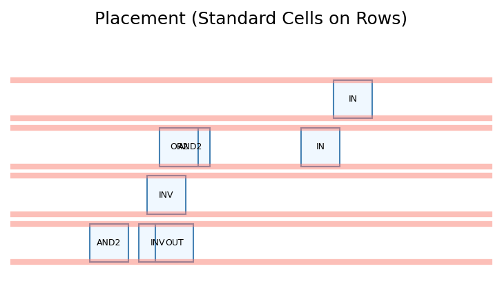
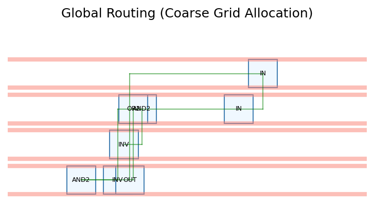
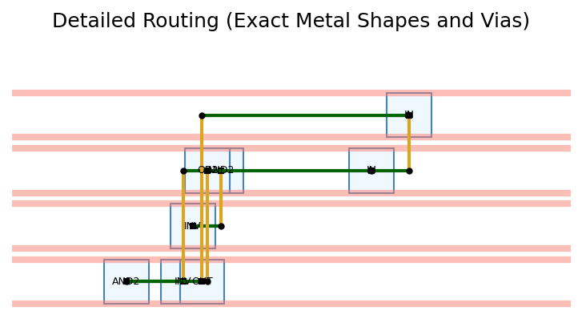

# EDA Flow Report for `test1.v`

## 1. RTL to Logic Synthesis
Extracting boolean equations from Verilog:
```verilog
x = (~a & b & c) | (~a & b & ~c)
y = (~b & ~c) | (a & ~b) | (a & c)
```

## 2. Technology Independent Synthesis
Simplifying boolean equations (using Quine-McCluskey / Sympy):
```text
x = b & ~a
y = (a & c) | (~b & ~c)
```

## 3. Technology Dependent Synthesis
Mapping to Standard Cell Library (AND, OR, NOT, XOR):
```text
Net 'x' requires cells: INV, AND2
Net 'y' requires cells: INV, AND2, OR2
```

## 4. Placement
Placing standard cells onto chip rows.



## 5. Global Routing
Allocating routing resources and determining coarse paths.



## 6. Detailed Routing
Drawing exact metal traces, vias, and pin connections.



