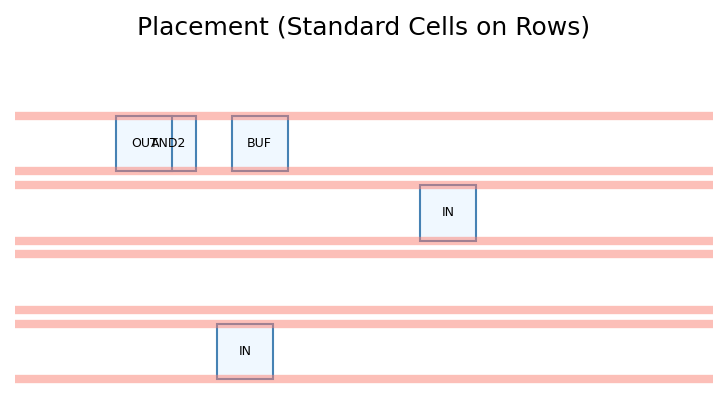
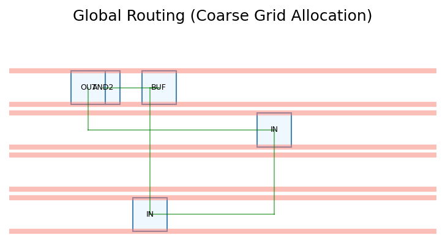
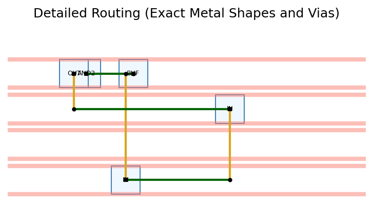

# EDA Flow Report for `test3.v`

## 1. RTL to Logic Synthesis
Extracting boolean equations from Verilog:
```verilog
out1 = (a | a) & b
out2 = a ^ a
```

## 2. Technology Independent Synthesis
Simplifying boolean equations (using Quine-McCluskey / Sympy):
```text
out1 = a & b
out2 = False
```

## 3. Technology Dependent Synthesis
Mapping to Standard Cell Library (AND, OR, NOT, XOR):
```text
Net 'out1' requires cells: AND2
Net 'out2' requires cells: BUF
```

## 4. Placement
Placing standard cells onto chip rows.



## 5. Global Routing
Allocating routing resources and determining coarse paths.



## 6. Detailed Routing
Drawing exact metal traces, vias, and pin connections.



