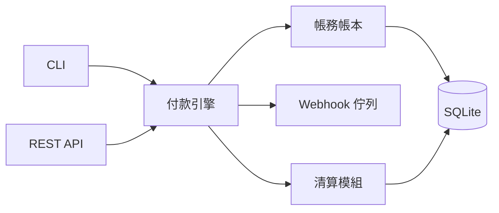

# MyPay 自建金流系統

展示一套從頭實作的金流引擎，不依賴任何第三方金流 SDK。涵蓋商家管理、訂單收款、雙式記帳帳本、清算撥款、Webhook 通知等核心功能。

## 快速開始

```bash
cd code/軟體工程/pay4
pip install -r requirements.txt
./test.sh
```

## 功能

| 模組 | 功能 |
|------|------|
| `core/merchant.py` | 商家註冊、API Key 產生、查詢、狀態管理 |
| `core/engine.py` | 建立訂單、模擬付款、退款、逾時過期 (狀態機) |
| `core/ledger.py` | 雙式記帳：每筆交易借貸平衡，支援科目餘額查詢 |
| `core/settlement.py` | 批次清算：彙總已付款訂單，計算手續費，撥款 |
| `core/webhook.py` | 事件佇列、HMAC-SHA256 簽章、重試機制 |
| `cli.py` | 完整 CLI 管理介面 |
| `api.py` | FastAPI REST API (API Key 驗證) |

## 架構



每筆付款產生兩筆交易：`payment`（入商家餘額）和 `fee`（手續費轉入平台收入），保持借貸平衡。
