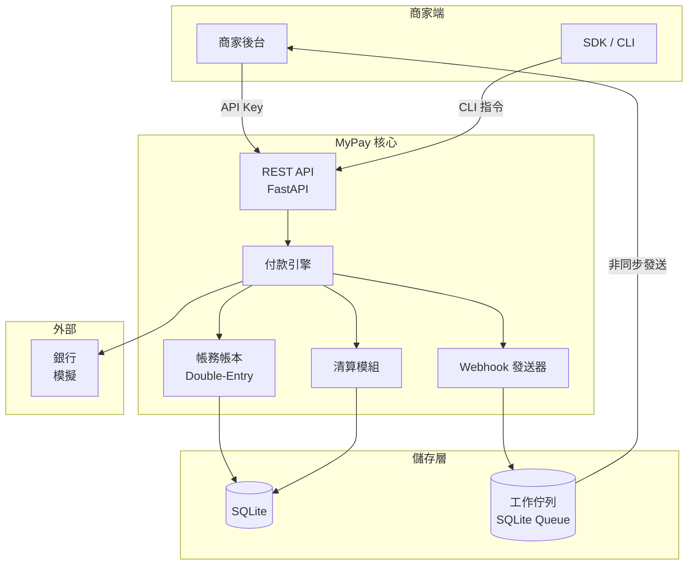
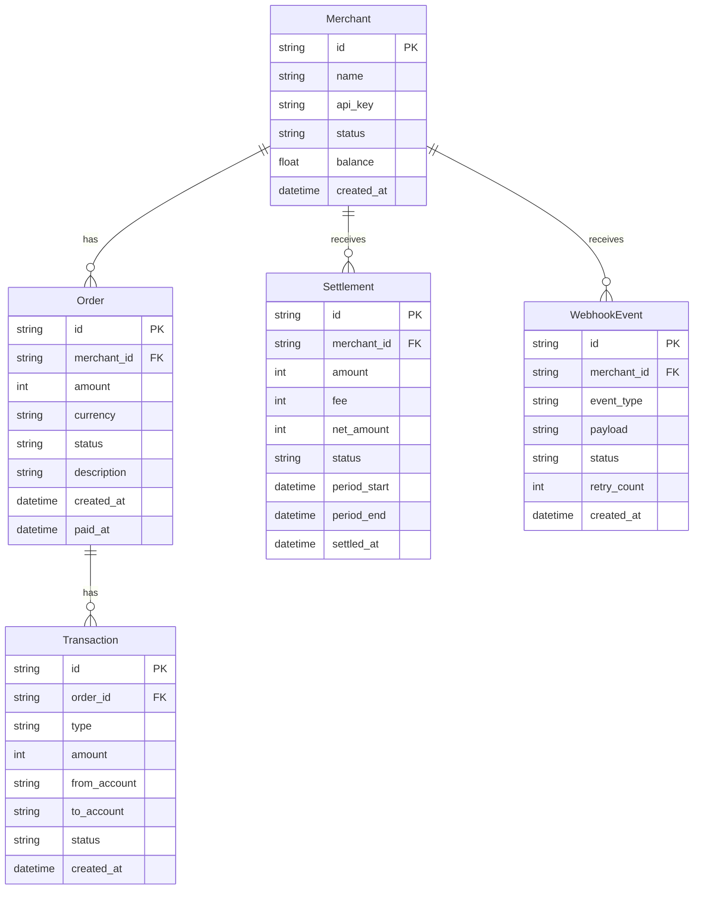
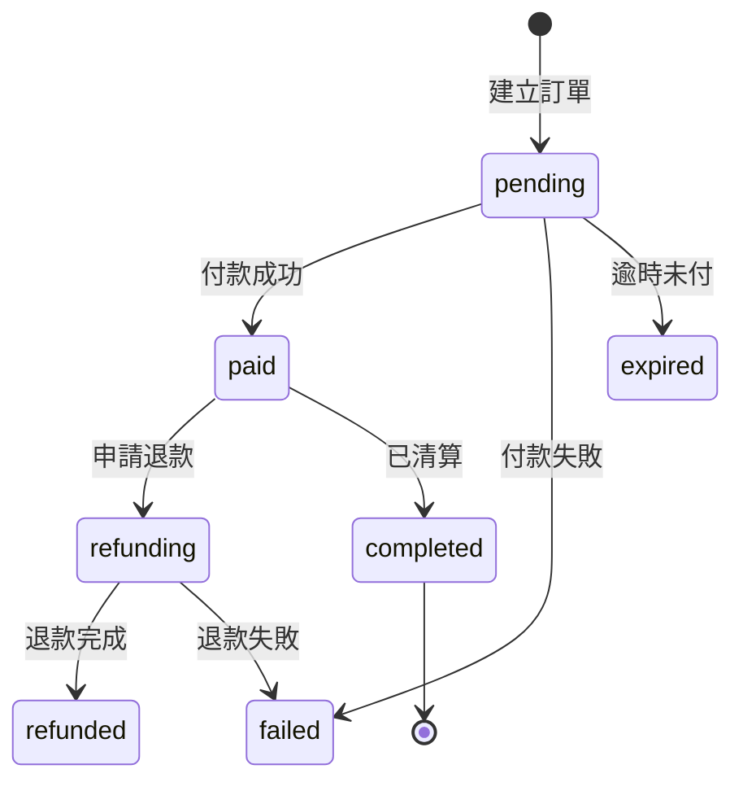

# MyPay 自建金流系統 — 規劃書

## 動機

現有金流整合範例（`payment/stripe_gateway.py`, `payment/ecpay_gateway.py`）都是串接第三方閘道。MyPay 的目的是展示「自己當金流公司」——從頭實作一套微型金流引擎，涵蓋商家管理、訂單收款、內部帳務、清算撥款、退款爭議等核心流程。

## 系統架構



## 核心模型



## 功能模組

### 1. 商家管理 (`merchant.py`)

| 功能 | 說明 |
|------|------|
| 註冊商家 | name, email → 產生 merchant_id + api_key |
| API Key 驗證 | 每次請求驗證 X-API-Key |
| 商家查詢 | 查詢餘額、交易明細 |
| 商家狀態 | active / suspended / closed |

### 2. 付款引擎 (`engine.py`)

| 功能 | 說明 |
|------|------|
| 建立訂單 | 商家發起收款請求，產生 Order (status=pending) |
| 模擬付款 | 模擬買方付款（成功/失敗/逾時） |
| 訂單完成 | status → paid, 記帳, 觸發 webhook |
| 訂單過期 | 未付款訂單自動過期 (status=expired) |

付款狀態機：



### 3. 帳務帳本 (`ledger.py`)

採用雙式記帳 (double-entry accounting)，每筆交易至少影響兩個科目：

| 科目 | 類型 | 說明 |
|------|------|------|
| `merchant:{id}:receivable` | 資產 | 商家應收款 |
| `merchant:{id}:balance` | 負債 | 商家可提領餘額 |
| `my pay:revenue` | 收入 | 手續費收入 |
| `my pay:bank` | 資產 | 銀行存款 |

記帳範例：訂單 $100, 手續費 3%

```
商家應收款     +$100
手續費收入     -$3
銀行存款       +$97
```

### 4. 清算撥款 (`settlement.py`)

| 功能 | 說明 |
|------|------|
| 批次清算 | 每日/每週批次結算商家可提領金額 |
| 手續費計算 | 依合約費率計算（階梯式/固定式） |
| 撥款記錄 | 產生 Settlement 記錄 |
| 餘額更新 | 清算後更新商家 balance |

### 5. Webhook 發送 (`webhook.py`)

| 功能 | 說明 |
|------|------|
| 事件佇列 | 付款成功/退款完成等事件先入佇列 |
| 非同步發送 | 背景執行緒 POST 到商家 registered URL |
| 重試機制 | 失敗後重試 (3 次, exponential backoff) |
| 簽章 | 使用 HMAC-SHA256 簽署 payload |

### 6. CLI 管理 (`cli.py`)

| 指令 | 說明 |
|------|------|
| `mypay merchant create <name>` | 註冊新商家 |
| `mypay merchant list` | 列出所有商家 |
| `mypay order create <merchant> <amount>` | 建立測試訂單 |
| `mypay order pay <order-id>` | 模擬付款 |
| `mypay order refund <order-id>` | 退款 |
| `mypay settle <merchant>` | 執行清算 |
| `mypay ledger <merchant>` | 查看帳本 |

### 7. REST API (`api.py`)

| 方法 | 路徑 | 說明 |
|------|------|------|
| POST | `/v1/orders` | 建立訂單 |
| GET | `/v1/orders/{id}` | 查詢訂單 |
| POST | `/v1/orders/{id}/pay` | 模擬付款 |
| POST | `/v1/orders/{id}/refund` | 退款 |
| GET | `/v1/merchants/{id}/balance` | 查詢餘額 |
| GET | `/v1/merchants/{id}/transactions` | 交易明細 |

## 目錄結構

```
mypay/
├── __init__.py
├── cli.py             # CLI 管理介面
├── api.py             # FastAPI REST API
├── models.py          # Pydantic 資料模型
├── database.py        # SQLite 儲存層
├── core/
│   ├── __init__.py
│   ├── engine.py      # 付款引擎（狀態機）
│   ├── ledger.py      # 帳務帳本（雙式記帳）
│   ├── merchant.py    # 商家管理
│   ├── settlement.py  # 清算撥款
│   └── webhook.py     # Webhook 發送
├── tests/
│   ├── __init__.py
│   ├── test_merchant.py
│   ├── test_engine.py
│   ├── test_ledger.py
│   └── test_settlement.py
├── test.sh
└── AGENTS.md
```

## 實作順序

參考 `ccc_code_skill.md`:

1. **v0.1** — 核心資料模型 + 資料庫層 (`models.py`, `database.py`)
2. **v0.2** — 商家管理 (`core/merchant.py`) + CLI `merchant create/list`
3. **v0.3** — 付款引擎 (`core/engine.py`) + CLI `order create/pay`
4. **v0.4** — 帳務帳本 (`core/ledger.py`) — 雙式記帳、科目管理
5. **v0.5** — 清算撥款 (`core/settlement.py`) + CLI `settle`
6. **v0.6** — Webhook 發送 (`core/webhook.py`) — 事件佇列 + 重試
7. **v0.7** — REST API (`api.py`) — FastAPI 完整 API
8. **v0.8** — 測試完整覆蓋 + 整合測試

## 設計原則

| 原則 | 說明 |
|------|------|
| KISS | 不做多餘抽象，先用簡單的 if/else 實作狀態機 |
| 離線優先 | 所有操作先寫 DB，再觸發副作用（webhook 等） |
| 不可變交易 | Transaction 一旦寫入不可修改，只能做沖正交易 |
| 冪等性 | 同一請求重複提交不會產生重複效果 (idempotency key) |
| 不依賴第三方 | 純 Python + SQLite，零外部金流 SDK |

## 技術選型

| 元件 | 選擇 | 理由 |
|------|------|------|
| 語言 | Python 3.11+ | 與其他範例一致 |
| Web 框架 | FastAPI | 與 todo-py 一致 |
| 資料庫 | SQLite (stdlib) | 零設定，示範用 |
| 測試 | pytest | 全專案統一 |
| CLI | argparse | Python 內建 |
| 佇列 | SQLite 輪詢 | 簡單夠用，不引入 Redis |
