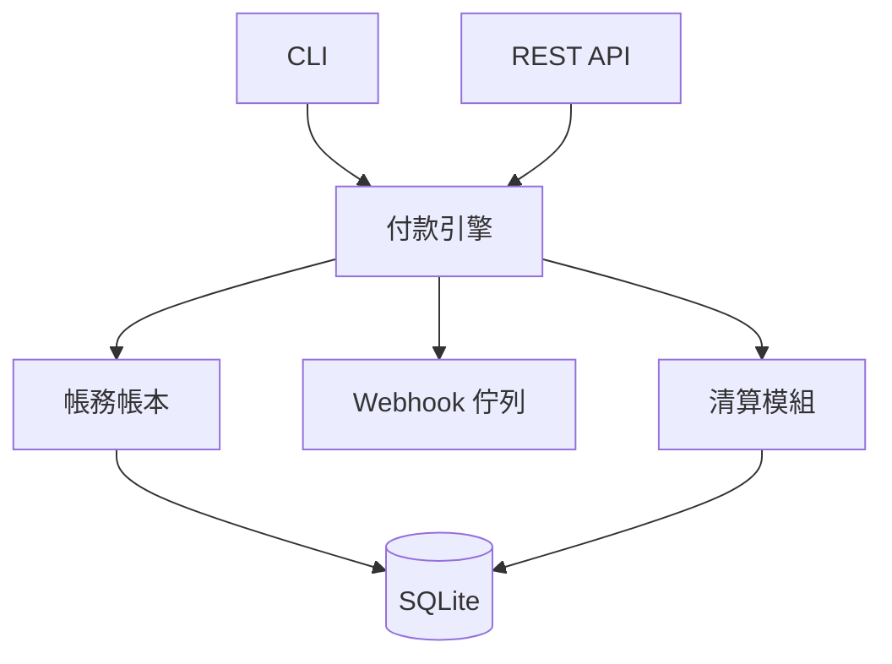
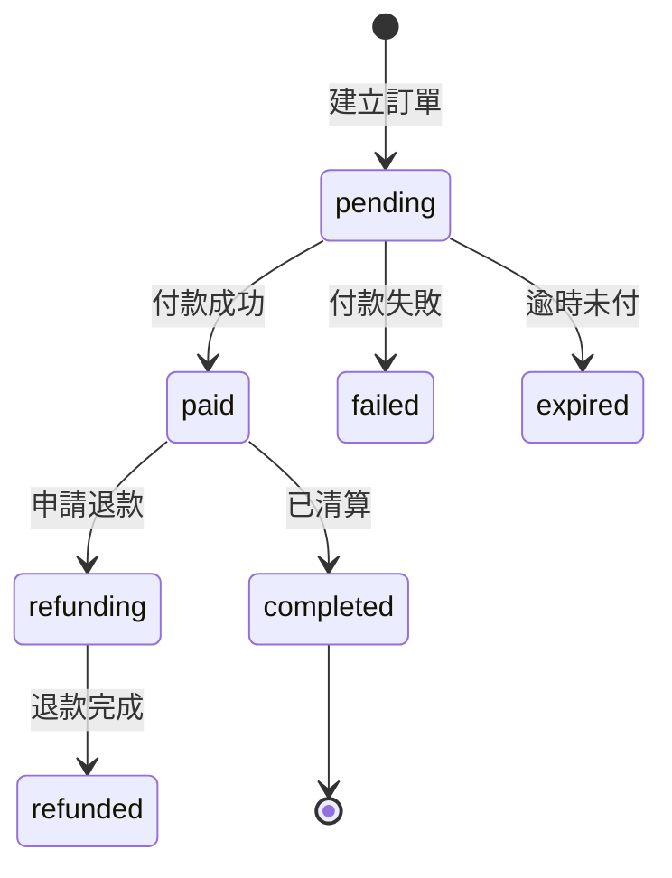

# Pay4 自建金流系統

Pay4 是一套從頭實作的金流引擎，不依賴任何第三方金流 SDK。涵蓋商家管理、訂單收款、雙式記帳帳本、清算撥款、Webhook 通知等金流公司核心功能。

## 設計動機

現有金流整合範例（Stripe、綠界）都是串接第三方閘道。Pay4 的目的是展示「自己當金流公司」——理解金流系統內部的運作原理，包括：

- 商家如何註冊並取得 API Key
- 付款狀態如何在資料庫中流轉
- 雙式記帳如何確保每筆交易借貸平衡
- 批次清算如何計算手續費並撥款
- Webhook 如何確保事件送達

## 系統架構



## 核心模組

### 商家管理 (`core/merchant.py`)

| 功能 | 說明 |
|------|------|
| `create_merchant()` | 註冊商家，產生 `m_` 開頭的 ID + `pay4_` 開頭的 API Key |
| `get_merchant()` | 依 ID 查詢商家 |
| `get_merchant_by_api_key()` | API Key 驗證 |
| `list_merchants()` | 列出所有商家 |
| `update_merchant_balance()` | 更新商家餘額（清算時使用） |

### 付款引擎 (`core/engine.py`)

付款狀態機：



| 功能 | 說明 |
|------|------|
| `create_order()` | 建立訂單 (status=pending) |
| `pay_order()` | 模擬付款 → status=paid, 自動記帳 + 觸發 webhook |
| `refund_order()` | 退款 → status=refunded, 自動沖正交易 |
| `expire_old_orders()` | 逾時訂單過期 (status=expired) |

### 雙式記帳 (`core/ledger.py`)

採用複式記帳 (double-entry accounting)，每筆交易至少影響兩個科目，維持借貸平衡：

```
科目表:
  merchant:{id}:receivable    資產  (應收款)
  merchant:{id}:balance       負債  (可提領餘額)
  pay4:revenue                收入  (手續費)
  pay4:bank                   資產  (銀行存款)
```

記帳範例：訂單 $1000, 手續費 3%

```
                     借方                   貸方
  merchant:A:receivable   +$970               (應收款減少)
  merchant:A:balance                  +$970    (餘額增加)
  merchant:A:balance      +$30                 (手續費扣除)
  pay4:revenue                        +$30    (收入增加)
```

清算撥款時：

```
  merchant:A:balance      +$970               (餘額扣除)
  pay4:bank                        +$970      (銀行存款增加)
```

### 清算撥款 (`core/settlement.py`)

| 功能 | 說明 |
|------|------|
| `create_settlement()` | 彙總商家已付款訂單，計算手續費，執行撥款 |
| `list_settlements()` | 查詢清算記錄 |

清算流程：

1. 查詢商家所有 `status=paid` 且未清算的訂單
2. 彙總總金額、總手續費
3. 計算淨額 (總金額 - 總手續費)
4. 建立 Settlement 記錄
5. 記帳：商家餘額 → 銀行存款
6. 更新商家餘額
7. 觸發 `settlement.completed` webhook

### Webhook 發送 (`core/webhook.py`)

- `enqueue_webhook()` — 事件入佇列（僅在商家有設定 webhook_url 時）
- `sign_payload()` — HMAC-SHA256 簽署 payload
- `process_webhook_queue()` — 背景發送，最多重試 3 次

## 目錄結構

```
pay4/
├── pay4/
│   ├── cli.py            # CLI 管理介面 (7 組子指令)
│   ├── api.py            # FastAPI REST API (API Key 驗證, 7 endpoints)
│   ├── models.py         # Pydantic 模型
│   ├── database.py       # SQLite 儲存層
│   └── core/
│       ├── merchant.py   # 商家管理
│       ├── engine.py     # 付款狀態機
│       ├── ledger.py     # 雙式記帳
│       ├── settlement.py # 清算撥款
│       └── webhook.py    # Webhook 發送
├── tests/                # 30 項測試
├── test.sh
├── AGENTS.md
├── README.md
└── _doc/plan.md          # 規劃書
```

## CLI 指令

```bash
python -m pay4.cli init                                    # 初始化資料庫
python -m pay4.cli merchant create my_shop shop@test.com   # 註冊商家
python -m pay4.cli merchant list                           # 列出商家
python -m pay4.cli merchant show <id>                      # 檢視商家
python -m pay4.cli order create <mid> 1000                 # 建立訂單
python -m pay4.cli order pay <oid>                         # 模擬付款
python -m pay4.cli order refund <oid>                      # 退款
python -m pay4.cli order list --merchant-id <mid>          # 列出訂單
python -m pay4.cli settle create <mid>                     # 清算撥款
python -m pay4.cli balance <account>                       # 查詢科目餘額
python -m pay4.cli ledger <mid>                            # 檢視帳本
```

## REST API

| 方法 | 路徑 | 說明 |
|------|------|------|
| POST | `/v1/merchants` | 註冊商家 (公開) |
| GET | `/v1/merchants` | 列出所有商家 |
| POST | `/v1/orders` | 建立訂單 (需 API Key) |
| GET | `/v1/orders` | 列出商家訂單 |
| GET | `/v1/orders/{id}` | 查詢訂單 |
| POST | `/v1/orders/{id}/pay` | 模擬付款 |
| POST | `/v1/orders/{id}/refund` | 退款 |
| GET | `/v1/merchants/{id}/balance` | 查詢餘額 |
| GET | `/v1/merchants/{id}/transactions` | 交易明細 |

## 資料庫 Schema

```sql
-- 商家
CREATE TABLE merchants (
    id TEXT PRIMARY KEY,
    name TEXT NOT NULL,
    email TEXT NOT NULL,
    api_key TEXT NOT NULL UNIQUE,
    webhook_url TEXT DEFAULT '',
    fee_rate REAL DEFAULT 0.03,
    status TEXT DEFAULT 'active',
    balance INTEGER DEFAULT 0,
    created_at TEXT DEFAULT (datetime('now'))
);

-- 訂單 (付款狀態機)
CREATE TABLE orders (
    id TEXT PRIMARY KEY,
    merchant_id TEXT NOT NULL,
    amount INTEGER NOT NULL,
    status TEXT DEFAULT 'pending',
    -- pending / paid / failed / expired / refunding / refunded
    created_at TEXT DEFAULT (datetime('now')),
    paid_at TEXT,
    updated_at TEXT DEFAULT (datetime('now')),
    FOREIGN KEY (merchant_id) REFERENCES merchants(id)
);

-- 交易記錄 (雙式記帳，不可篡改)
CREATE TABLE transactions (
    id TEXT PRIMARY KEY,
    type TEXT NOT NULL,         -- payment / fee / refund / fee_reversal / settlement
    from_account TEXT NOT NULL,
    to_account TEXT NOT NULL,
    amount INTEGER NOT NULL,
    order_id TEXT DEFAULT '',
    settlement_id TEXT DEFAULT '',
    created_at TEXT DEFAULT (datetime('now'))
);
```

## 測試

30 項測試，使用 SQLite `:memory:` 模式，每項測試獨立隔離：

```bash
cd code/軟體工程/pay4
./test.sh
```

測試涵蓋：商家 CRUD、訂單狀態機、付款/退款餘額正確性、雙式記帳借貸平衡、清算撥款流程。

## 與 payment/ 的關係

`payment/` 是金流整合範例目錄，其中 `pay4_gateway.py` 將 Pay4 包裝成與 Stripe/ECPay 一致的 `create_payment()` / `refund()` 介面，可透過 `PaymentGateway` 統一處理器選擇 `--provider pay4` 操作。

詳見 [金流整合範例](金流整合範例.md)。

## 相關主題

- [金流整合範例](金流整合範例.md) — payment/ 目錄的三閘道整合
- [金流整合](金流整合.md) — 金流方案比較
- [API 設計](API設計.md) — REST API 設計模式
- [雙式記帳](https://en.wikipedia.org/wiki/Double-entry_bookkeeping) — Wikipedia
